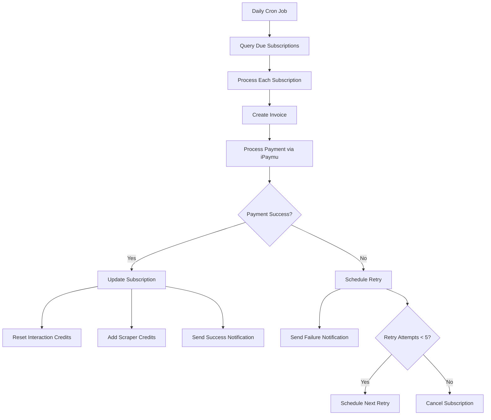

# Monthly Billing Cycle Implementation Summary

This document provides a comprehensive summary of the Monthly Billing Cycle automated system process implementation plan, including all components, dependencies, and next steps.

## Project Overview

The Monthly Billing Cycle is a critical automated system that handles subscription renewals, payment processing, credit allocation, and customer notifications. It ensures reliable recurring revenue while providing a smooth experience for customers.

## System Architecture

### Core Components

1. **Billing Cron Job** - Internal scheduler that runs daily to check for due subscriptions
2. **Billing Service** - Core service that orchestrates the renewal process
3. **Payment Gateway Integration** - iPaymu integration for payment processing
4. **Credit Management Service** - Handles credit reset and accumulation
5. **Notification Service** - Manages email notifications with invoice PDFs
6. **Retry Management** - Handles payment retry logic with 5 attempts

### Data Flow



## Implementation Status

### Completed Documentation ✅

1. **Implementation Plan** - Comprehensive architecture and design document
2. **Database Migrations** - SQL scripts for new tables and functions
3. **API Implementation Guide** - Detailed code examples for all endpoints
4. **Testing Strategy** - Unit, integration, and E2E testing approaches
5. **Setup & Deployment Guide** - Step-by-step deployment instructions

### Pending Implementation 🔄

1. **Database Functions** - Credit reset and accumulation operations
2. **API Endpoints** - Credit management and billing endpoints
3. **Payment Gateway** - iPaymu integration with sandbox mode
4. **Retry Logic** - 5-attempt retry system (1, 2, 4, 7, 14 days)
5. **Scheduler** - Internal cron job for daily billing checks
6. **Notifications** - Enhanced system with invoice PDFs
7. **Error Handling** - Comprehensive logging and error management
8. **Monitoring** - Health checks and alerting system
9. **Tests** - Complete test suite for all components

## Key Features

### Payment Processing

- **iPaymu Integration** - Indonesian payment gateway with sandbox support
- **Multiple Payment Methods** - Credit cards, bank transfer, e-wallets
- **Webhook Handling** - Real-time payment status updates
- **Security** - Signature verification and PCI compliance

### Credit Management

- **Interaction Credits** - Monthly reset (discard old balance, add new allocation)
- **Scraper Credits** - Accumulative (add to existing balance)
- **Transaction Logging** - Complete audit trail in credit ledger
- **Balance Tracking** - Real-time balance calculations

### Retry Logic

- **5 Retry Attempts** - At 1, 2, 4, 7, and 14 days
- **Smart Scheduling** - Exponential backoff for payment retries
- **Automatic Cancellation** - After 5 failed attempts
- **Customer Communication** - Clear notifications at each step

### Notification System

- **Email Templates** - Professional billing notifications
- **Invoice PDFs** - Generated and attached to emails
- **Multi-language Support** - Ready for internationalization
- **Delivery Tracking** - Monitor email delivery status

## Technical Specifications

### Database Schema

#### New Tables

1. **payment_retries** - Track payment retry attempts
2. **billing_logs** - Audit all billing operations

#### New Functions

1. **reset_interaction_credits** - Reset interaction credits to new allocation
2. **add_scraper_credits** - Add scraper credits to existing balance
3. **schedule_payment_retry** - Schedule retry attempts
4. **cancel_subscription** - Cancel subscription after failed retries
5. **log_billing_event** - Log all billing operations

### API Endpoints

#### Credit Management

- `POST /api/credits/interaction/reset` - Reset interaction credits
- `POST /api/credits/scraper/add` - Add scraper credits

#### Billing Operations

- `POST /api/billing/renew` - Process due subscriptions
- `POST /api/billing/retry` - Process scheduled retries
- `POST /api/billing/webhook` - Handle iPaymu webhooks
- `GET /api/billing/health` - System health check

### Environment Variables

```env
# Payment Gateway
IPAYMU_API_KEY=your-api-key
IPAYMU_SANDBOX=true/false
IPAYMU_WEBHOOK_SECRET=webhook-secret

# Security
BILLING_CRON_SECRET=secure-secret-key

# Application
NEXT_PUBLIC_APP_URL=https://your-domain.com
```

## Implementation Roadmap

### Phase 1: Foundation (Week 1-2)

1. **Database Setup**
   - Run migration scripts
   - Create database functions
   - Set up indexes and constraints

2. **Basic API Endpoints**
   - Credit management endpoints
   - Basic billing renewal endpoint
   - Error handling framework

### Phase 2: Payment Integration (Week 3-4)

1. **iPaymu Integration**
   - Payment service implementation
   - Webhook handler
   - Error handling for payment failures

2. **Retry Logic**
   - Retry scheduling system
   - Retry processing endpoint
   - Subscription cancellation logic

### Phase 3: Advanced Features (Week 5-6)

1. **Notification System**
   - Email service integration
   - Invoice PDF generation
   - Template system

2. **Scheduler Implementation**
   - Internal cron job system
   - Health monitoring
   - Error alerting

### Phase 4: Testing & Deployment (Week 7-8)

1. **Comprehensive Testing**
   - Unit tests for all components
   - Integration tests for complete flows
   - E2E tests with real payments

2. **Production Deployment**
   - Staging environment testing
   - Production rollout
   - Monitoring setup

## Risk Mitigation

### Technical Risks

1. **Payment Gateway Downtime**
   - Mitigation: Retry logic with exponential backoff
   - Monitoring: Real-time payment gateway status

2. **Database Performance**
   - Mitigation: Proper indexing and query optimization
   - Monitoring: Database performance metrics

3. **Credit Calculation Errors**
   - Mitigation: Transaction logging and reconciliation
   - Monitoring: Daily balance verification

### Business Risks

1. **Customer Churn Due to Payment Failures**
   - Mitigation: Clear communication and retry attempts
   - Monitoring: Payment failure rate tracking

2. **Revenue Recognition Issues**
   - Mitigation: Accurate invoice generation and logging
   - Monitoring: Revenue reconciliation reports

## Success Metrics

### Technical Metrics

- **System Uptime**: > 99.9%
- **Payment Success Rate**: > 95%
- **API Response Time**: < 2 seconds
- **Error Rate**: < 1%

### Business Metrics

- **Monthly Recurring Revenue (MRR)**
- **Customer Lifetime Value (CLV)**
- **Churn Rate**: < 5% monthly
- **Payment Failure Recovery Rate**: > 80%

## Next Steps

1. **Review and Approve** - Stakeholder review of implementation plan
2. **Resource Allocation** - Assign development team members
3. **Timeline Confirmation** - Adjust based on team capacity
4. **Development Start** - Begin Phase 1 implementation
5. **Regular Check-ins** - Weekly progress reviews
6. **Testing and Deployment** - Follow roadmap phases

## Support and Maintenance

### Ongoing Tasks

1. **Daily Monitoring**
   - Check billing process execution
   - Review payment success rates
   - Monitor system health

2. **Weekly Maintenance**
   - Review retry queue
   - Update documentation
   - Performance optimization

3. **Monthly Reviews**
   - Analyze billing metrics
   - Customer feedback review
   - System improvements

### Emergency Procedures

1. **Payment Failures**
   - Immediate notification
   - Manual retry process
   - Customer communication

2. **System Outages**
   - Fallback procedures
   - Data recovery
   - Service restoration

## Conclusion

The Monthly Billing Cycle implementation provides a robust, scalable solution for automated subscription management. With comprehensive error handling, retry logic, and customer communication, it ensures reliable revenue generation while maintaining customer satisfaction.

The modular architecture allows for easy maintenance and future enhancements, while the comprehensive testing strategy ensures system reliability.

Following the implementation roadmap will result in a production-ready billing system that meets all business requirements and provides a solid foundation for future growth.