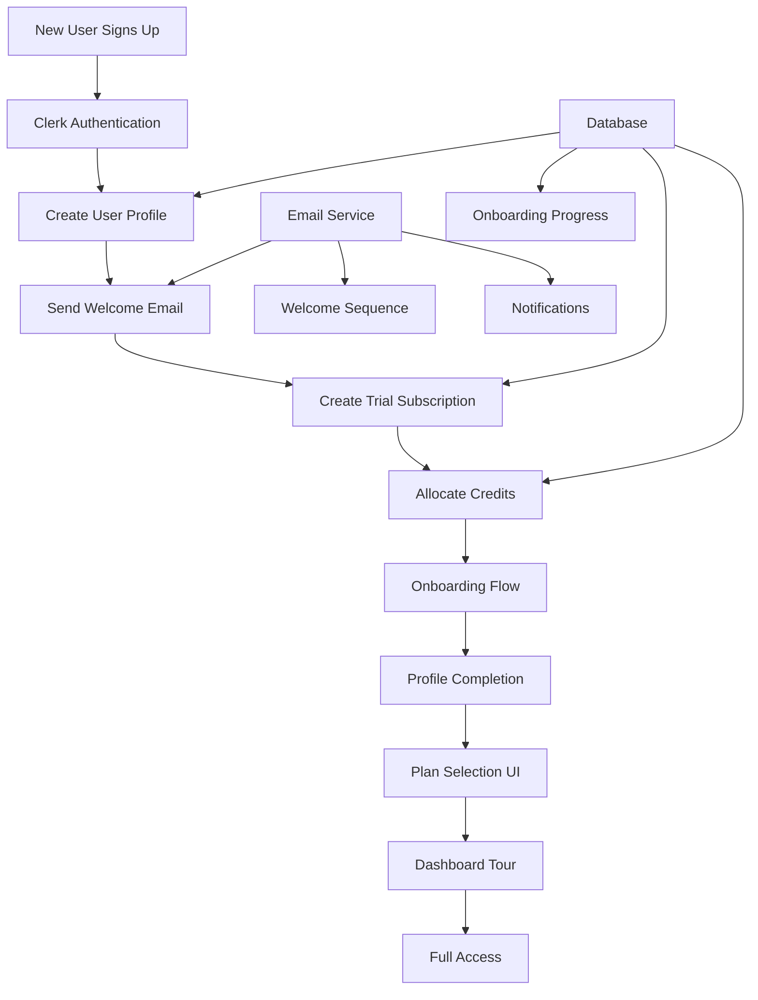

# User Onboarding & Subscription Selection Flow - Implementation Summary

## Overview
This document provides a comprehensive summary of the User Onboarding & Subscription Selection flow implementation for the AI Marketing Platform. The implementation enhances the existing system with a complete onboarding experience, email notifications, and user guidance.

## Current System State
- ✅ Clerk authentication implemented
- ✅ Basic user profile creation exists
- ✅ Trial subscription creation is functional
- ✅ Credit allocation system works
- ❌ No email service integration
- ❌ No onboarding flow for new users
- ❌ No profile completion steps
- ❌ No welcome email sequence
- ❌ No plan selection UI for new users

## Implementation Architecture



## Implementation Phases

### Phase 1: Email Service Integration (High Priority)
**Files Created:**
- `src/lib/email-service.ts` - Core email service with Resend integration
- `src/emails/welcome-email.tsx` - Welcome email template
- `src/emails/verify-email.tsx` - Email verification template
- `src/app/api/emails/send/route.ts` - Email sending API endpoint
- `supabase/migrations/003_email_tracking.sql` - Email tracking database schema

**Key Features:**
- Resend email service integration
- Email template system with React Email
- Email delivery tracking
- Error handling and logging
- Support for multiple email types

### Phase 2: User Profile Completion Flow (High Priority)
**Files Created:**
- `src/app/api/onboarding/profile/route.ts` - Profile completion API
- `src/app/onboarding/profile/page.tsx` - Multi-step profile completion UI
- `src/hooks/use-profile-completion.ts` - Profile completion hook
- `src/components/profile-progress-indicator.tsx` - Progress indicator component
- `supabase/migrations/004_profile_completion.sql` - Profile completion database schema

**Key Features:**
- Multi-step profile completion wizard
- Form validation with Zod
- Progress tracking and persistence
- Industry and company size selection
- Goals and experience level capture

### Phase 3: Plan Selection UI (High Priority)
**Files Created:**
- `src/app/api/onboarding/select-plan/route.ts` - Plan selection API
- `src/app/onboarding/plans/page.tsx` - Interactive plan selection UI
- `src/components/plan-comparison.tsx` - Plan comparison component
- `src/hooks/use-plan-selection.ts` - Plan selection hook

**Key Features:**
- Interactive plan comparison
- Personalized plan recommendations
- Monthly/annual billing options
- Feature comparison table
- Seamless upgrade flow

### Phase 4: Onboarding Progress Tracking (Medium Priority)
**Files Created:**
- `src/app/api/onboarding/progress/route.ts` - Progress tracking API
- `src/app/onboarding/page.tsx` - Main onboarding wizard
- `src/hooks/use-onboarding-progress.ts` - Progress tracking hook

**Key Features:**
- Step-by-step onboarding wizard
- Progress persistence
- Skip functionality
- Resume capability

### Phase 5: Email Verification Flow (Medium Priority)
**Files Created:**
- `src/app/api/auth/verify-email/route.ts` - Email verification API
- `src/app/verify-email/page.tsx` - Email verification UI
- `src/emails/verify-email.tsx` - Verification email template

**Key Features:**
- Secure email verification tokens
- Token expiration handling
- Verification status tracking
- Auto-redirect after verification

### Phase 6: Welcome Email Sequence (Medium Priority)
**Files Created:**
- `src/lib/email-sequence.ts` - Email sequence scheduler
- `src/emails/welcome-sequence/` - Multiple email templates
- `src/app/api/emails/sequence/route.ts` - Sequence management API

**Key Features:**
- Automated email sequence
- Day-based scheduling
- User segmentation
- Unsubscribe handling

### Phase 7: Dashboard Onboarding Tour (Low Priority)
**Files Created:**
- `src/components/onboarding/tour.tsx` - Interactive tour component
- `src/hooks/use-dashboard-tour.ts` - Tour management hook
- `src/app/dashboard/page.tsx` - Updated with tour integration

**Key Features:**
- Step-by-step dashboard tour
- Interactive tooltips
- Progress tracking
- Dismiss/resume functionality

## Database Schema Updates

### New Tables Created:
1. **email_logs** - Track email delivery status
2. **email_verification_tokens** - Store verification tokens
3. **onboarding_progress** - Track onboarding completion
4. **email_sequences** - Manage automated email sequences

### Updated Tables:
1. **users** - Added profile completion fields
2. **subscriptions** - Enhanced with more status tracking

## API Endpoints Created

### Email Service:
- `POST /api/emails/send` - Send emails
- `GET /api/emails/logs` - Get email logs

### Profile Completion:
- `GET /api/onboarding/profile` - Get profile data
- `POST /api/onboarding/profile` - Update profile

### Plan Selection:
- `GET /api/onboarding/select-plan` - Get available plans
- `POST /api/onboarding/select-plan` - Select plan

### Progress Tracking:
- `GET /api/onboarding/progress` - Get onboarding progress
- `POST /api/onboarding/progress` - Update progress

### Email Verification:
- `POST /api/auth/verify-email` - Send verification
- `GET /api/auth/verify-email/:token` - Verify email

## Frontend Components Created

### Core Components:
- `ProfileProgressIndicator` - Show profile completion status
- `PlanComparison` - Interactive plan comparison
- `OnboardingTour` - Dashboard tour component
- `EmailTemplate` - Reusable email templates

### Pages:
- `/onboarding/profile` - Profile completion wizard
- `/onboarding/plans` - Plan selection interface
- `/onboarding` - Main onboarding flow
- `/verify-email` - Email verification page

## Integration Points

### With Existing System:
1. **User Service** - Enhanced with profile completion
2. **Subscription Service** - Integrated with plan selection
3. **Credit Management** - Allocated during onboarding
4. **Notification Service** - Enhanced with email sending

### Third-Party Integrations:
1. **Resend** - Email service provider
2. **Clerk** - Authentication system
3. **Supabase** - Database and real-time features

## Success Metrics

### Key Performance Indicators:
- **Onboarding Completion Rate**: Target 80%
- **Profile Completion Rate**: Target 90%
- **Email Open Rate**: Target 60%
- **Trial to Paid Conversion**: Target 25%
- **Time to First Value**: Target < 5 minutes

### Tracking Implementation:
- Event tracking for each onboarding step
- Email engagement metrics
- Conversion funnel analysis
- User behavior analytics

## Security Considerations

### Implemented Security Measures:
1. **Email Verification Tokens** - Secure, time-limited tokens
2. **Rate Limiting** - Prevent abuse of email sending
3. **Input Validation** - Zod schema validation
4. **CSRF Protection** - Built into Next.js
5. **Row Level Security** - Database access controls

## Performance Optimizations

### Implemented Optimizations:
1. **Email Queue Processing** - Asynchronous email sending
2. **Database Query Optimization** - Efficient data fetching
3. **Lazy Loading** - Onboarding components loaded as needed
4. **Caching** - User progress and plan data caching
5. **Progressive Enhancement** - Core functionality works without JS

## Testing Strategy

### Test Coverage:
1. **Unit Tests** - Individual component and function tests
2. **Integration Tests** - API endpoint and database tests
3. **E2E Tests** - Complete user flow tests
4. **Email Testing** - Template rendering and delivery tests

### Test Scenarios:
- New user complete onboarding flow
- Email verification process
- Plan selection and upgrade
- Profile completion validation
- Error handling and recovery

## Deployment Considerations

### Environment Variables Required:
```env
RESEND_API_KEY=your_resend_api_key
FROM_EMAIL=noreply@yourdomain.com
FROM_NAME="AI Marketing Platform"
APP_URL=https://yourdomain.com
```

### Database Migrations:
- Run migrations in order: 003, 004
- Verify RLS policies are applied
- Check indexes are created

### Monitoring Setup:
- Email delivery monitoring
- Onboarding funnel analytics
- Error tracking and alerting
- Performance metrics collection

## Future Enhancements

### Potential Improvements:
1. **A/B Testing** - Test different onboarding flows
2. **Personalization** - AI-driven plan recommendations
3. **Gamification** - Progress rewards and achievements
4. **Social Proof** - Testimonials and case studies
5. **Advanced Analytics** - Deeper user behavior insights

## Implementation Timeline

### Week 1: Core Infrastructure
- Email service integration
- Basic profile completion
- Plan selection UI

### Week 2: Enhanced Features
- Email verification flow
- Progress tracking
- Welcome email sequence

### Week 3: Polish & Optimization
- Dashboard onboarding tour
- Analytics implementation
- Performance optimization

## Conclusion

This implementation provides a comprehensive user onboarding experience that guides new users from sign-up to full platform utilization. The modular architecture allows for easy maintenance and future enhancements while maintaining security and performance standards.

The flow addresses key user needs:
- Clear guidance through initial setup
- Personalized plan recommendations
- Seamless email communication
- Progress tracking and motivation
- Easy upgrade paths

By implementing this onboarding flow, the AI Marketing Platform will see improved user engagement, higher conversion rates, and better long-term retention.