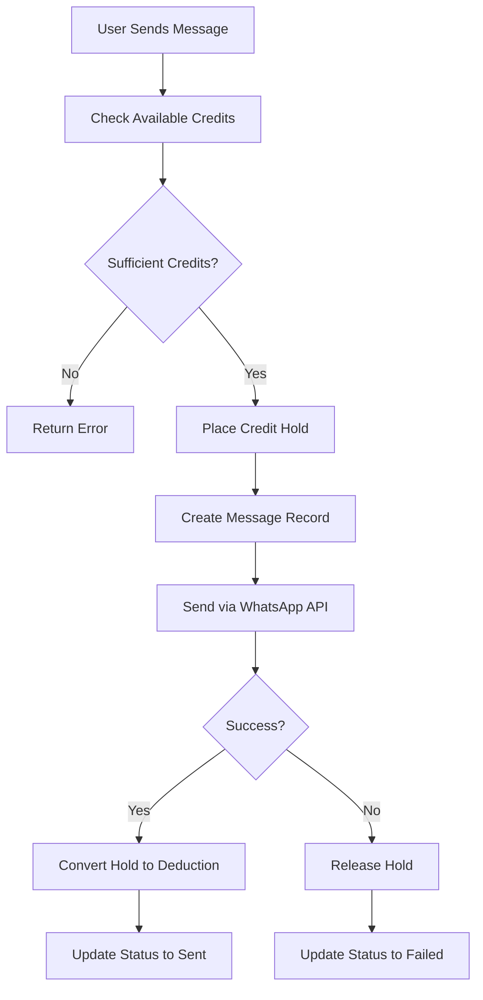

# Interaction Credit Implementation Summary

## Overview

This document provides a comprehensive summary of the Interaction Credit Usage flow implementation for WhatsApp messaging. The implementation follows the same credit hold mechanism used for scraper credits to ensure consistency and prevent double-spending.

## Implementation Documents Created

1. **[Interaction Credit Implementation Plan](./interaction-credit-usage-implementation-plan.md)**
   - High-level implementation strategy
   - Phased approach with timelines
   - Technical specifications
   - Risk mitigation strategies

2. **[Interaction Credit API Specification](./interaction-credit-api-specification.md)**
   - Detailed API endpoint specifications
   - Request/response formats
   - Error handling guidelines
   - Database function references

3. **[WhatsApp Credit Hold Implementation Guide](./whatsapp-credit-hold-implementation-guide.md)**
   - Step-by-step implementation instructions
   - Code examples and best practices
   - Security considerations
   - Performance optimization

4. **[Frontend Integration Guide](./frontend-interaction-credit-integration-guide.md)**
   - Component specifications
   - UI/UX guidelines
   - Real-time update strategies
   - Accessibility considerations

5. **[Testing Strategy](./interaction-credit-testing-strategy.md)**
   - Comprehensive testing approach
   - Unit, integration, and E2E tests
   - Performance and security testing
   - Test automation and reporting

## Key Implementation Components

### 1. API Endpoints

| Endpoint | Method | Description |
|----------|--------|-------------|
| `/api/credits/interaction/hold` | POST | Place temporary credit hold |
| `/api/credits/interaction/deduct` | POST | Convert hold to permanent deduction |
| `/api/credits/interaction/release-hold` | POST | Release hold without deduction |
| `/api/credits/interaction/balance` | GET | Get credit balance with holds |
| `/api/credits/interaction/holds` | GET | List user's credit holds |

### 2. Database Schema

The existing `credit_holds` table already supports interaction credits:
```sql
CREATE TABLE public.credit_holds (
  id UUID PRIMARY KEY DEFAULT gen_random_uuid(),
  user_id TEXT NOT NULL REFERENCES public.users(clerk_id),
  credit_type TEXT NOT NULL CHECK (credit_type IN ('scraper', 'interaction')),
  amount INTEGER NOT NULL,
  reference_id TEXT NOT NULL,
  status TEXT NOT NULL CHECK (status IN ('active', 'converted', 'released', 'expired')),
  expires_at TIMESTAMP WITH TIME ZONE NOT NULL,
  created_at TIMESTAMP WITH TIME ZONE DEFAULT NOW(),
  updated_at TIMESTAMP WITH TIME ZONE DEFAULT NOW()
);
```

### 3. WhatsApp Send Flow



### 4. Frontend Components

- **InteractionCreditDisplay**: Shows credit balance and held credits
- **MessageStatusIndicator**: Real-time message status updates
- **CreditHistory**: Transaction and hold history
- **CreditWarning**: Low credit alerts

## Implementation Benefits

### 1. Consistency
- Same credit hold mechanism as scraper credits
- Unified API patterns
- Consistent error handling

### 2. Reliability
- Prevents credit double-spending
- Atomic transactions
- Proper error recovery

### 3. User Experience
- Real-time credit updates
- Clear status indicators
- Helpful error messages

### 4. Scalability
- Efficient database operations
- Proper indexing
- Connection pooling

## Security Considerations

### 1. Authentication
- Clerk JWT validation
- User isolation
- Session management

### 2. Authorization
- User can only access own credits
- Proper permission checks
- Rate limiting

### 3. Data Protection
- Input validation
- SQL injection prevention
- Audit logging

## Performance Optimization

### 1. Database
- Appropriate indexes
- Connection pooling
- Query optimization

### 2. Caching
- Credit balance caching
- Response caching
- Cache invalidation

### 3. Frontend
- Component optimization
- Real-time updates
- Efficient rendering

## Monitoring and Alerting

### 1. Key Metrics
- Credit hold creation rate
- Hold conversion rate
- Message success rate
- API response times

### 2. Alert Conditions
- High failure rates
- Credit inconsistencies
- Performance degradation
- Security issues

## Testing Strategy

### 1. Unit Tests
- API endpoint testing
- Component testing
- Database function testing

### 2. Integration Tests
- End-to-end flow testing
- Database integration
- External API integration

### 3. Performance Tests
- Load testing
- Stress testing
- Scalability testing

### 4. Security Tests
- Authentication testing
- Authorization testing
- Input validation testing

## Implementation Timeline

### Phase 1: API Development (Week 1)
- [ ] Create interaction credit endpoints
- [ ] Implement error handling
- [ ] Add comprehensive logging
- [ ] Create unit tests

### Phase 2: WhatsApp Integration (Week 2)
- [ ] Update WhatsApp send route
- [ ] Implement credit hold mechanism
- [ ] Add proper error recovery
- [ ] Create integration tests

### Phase 3: Frontend Updates (Week 3)
- [ ] Create credit display components
- [ ] Update WhatsApp interface
- [ ] Add real-time updates
- [ ] Implement user feedback

### Phase 4: Testing & Deployment (Week 4)
- [ ] Comprehensive testing
- [ ] Performance optimization
- [ ] Security review
- [ ] Gradual rollout

## Success Criteria

### Functional Requirements
- [ ] Credit holds prevent double-spending
- [ ] Holds are properly converted or released
- [ ] Users see accurate credit information
- [ ] WhatsApp messages are sent reliably

### Performance Requirements
- [ ] API response times < 500ms
- [ ] Support 100+ concurrent operations
- [ ] 99.9% uptime for credit operations
- [ ] No data loss or corruption

### User Experience Requirements
- [ ] Clear credit usage information
- [ ] Helpful error messages
- [ ] Real-time status updates
- [ ] Intuitive interface

## Rollback Plan

### Triggers
- Database corruption
- Security vulnerabilities
- Performance degradation > 50%
- User complaint rate > 10%

### Procedures
1. Switch to previous implementation
2. Restore database if needed
3. Monitor system stability
4. Address issues before retry

## Next Steps

1. **Review and Approve**: Stakeholder review of implementation plan
2. **Resource Allocation**: Assign development team members
3. **Environment Setup**: Prepare development and testing environments
4. **Begin Implementation**: Start with Phase 1 - API Development
5. **Regular Check-ins**: Weekly progress reviews
6. **Quality Assurance**: Comprehensive testing before deployment

## Conclusion

The Interaction Credit Usage flow implementation provides a robust, secure, and user-friendly system for managing WhatsApp messaging credits. By following the credit hold mechanism established for scraper credits, we ensure consistency across the platform while preventing double-spending and providing clear visibility into credit usage.

The comprehensive documentation, testing strategy, and implementation guides ensure a smooth development process and reliable final product. The phased approach allows for incremental development and testing, minimizing risks and ensuring quality at each stage.

This implementation will significantly improve the reliability and user experience of WhatsApp messaging while maintaining the integrity of the credit system.