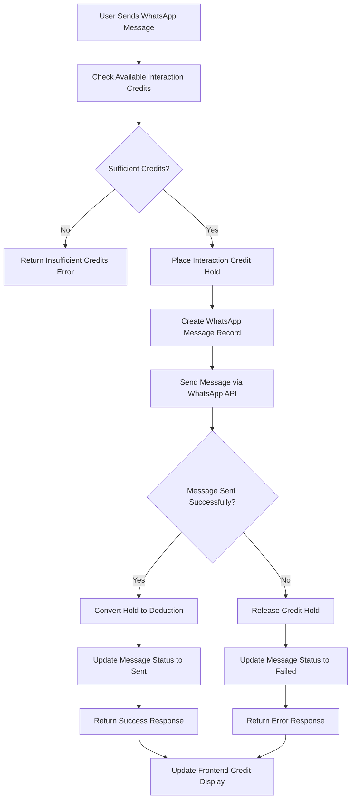

# Interaction Credit Usage (WhatsApp) Implementation Plan

## Executive Summary

This document provides a comprehensive implementation plan for the "Interaction Credit Usage (WhatsApp)" flow, which implements a robust credit hold mechanism similar to the scraper service to ensure consistency and prevent double-spending during WhatsApp message operations.

## Flow Overview

The new flow implements a three-phase credit management pattern for WhatsApp interactions:

1. **Hold Phase**: Temporarily reserve interaction credits before sending messages
2. **Execution Phase**: Send the message via WhatsApp API
3. **Resolution Phase**: Convert holds to deductions (success) or release holds (failure)



## Implementation Components

### 1. API Endpoints for Interaction Credits

**New Interaction Credit Endpoints:**
- `POST /api/credits/interaction/hold` - Place interaction credit holds
- `POST /api/credits/interaction/deduct` - Convert holds to deductions
- `POST /api/credits/interaction/release-hold` - Release holds
- `GET /api/credits/interaction/balance` - Get interaction credit balance
- `GET /api/credits/interaction/holds` - List user's interaction credit holds

### 2. Enhanced WhatsApp Send Endpoint

**Updated Flow:**
1. Check available interaction credits
2. Place a credit hold (1 credit per message)
3. Create WhatsApp message record with 'pending' status
4. Attempt to send via WhatsApp API
5. On success: Convert hold to deduction and update message status
6. On failure: Release hold and update message status with error

### 3. Frontend Updates

**Enhanced Credit Display:**
- Show interaction credits separately from scraper credits
- Display held interaction credits during message sending
- Real-time updates after message operations

**Improved User Experience:**
- Clear status indicators for message sending
- Enhanced error messages for credit issues
- Transaction history for WhatsApp messages

## Implementation Phases

### Phase 1: Create Interaction Credit API Endpoints (Week 1)
- [ ] Create interaction credit hold endpoint
- [ ] Create interaction credit deduct endpoint
- [ ] Create interaction credit release-hold endpoint
- [ ] Create interaction credit balance endpoint
- [ ] Create interaction credit holds listing endpoint
- [ ] Add comprehensive error handling
- [ ] Create unit tests for all endpoints

### Phase 2: Update WhatsApp Send Implementation (Week 2)
- [ ] Refactor WhatsApp send route to use credit hold mechanism
- [ ] Implement proper error handling and rollback
- [ ] Add structured logging for all operations
- [ ] Update message status tracking
- [ ] Create integration tests

### Phase 3: Frontend Integration (Week 3)
- [ ] Update credit display components to show interaction credits
- [ ] Add real-time credit updates during message sending
- [ ] Enhance WhatsApp page with better status indicators
- [ ] Improve error messaging for credit issues
- [ ] Add transaction history view

### Phase 4: Testing & Documentation (Week 4)
- [ ] Comprehensive end-to-end testing
- [ ] Performance testing under load
- [ ] Security review and penetration testing
- [ ] Update API documentation
- [ ] Create user guides and support documentation

## Technical Specifications

### API Contract Examples

**Hold Interaction Credits Request:**
```json
{
  "amount": 1,
  "reference_id": "whatsapp-msg-uuid",
  "expires_in_minutes": 30
}
```

**Hold Interaction Credits Response:**
```json
{
  "hold_id": "550e8400-e29b-41d4-a716-446655440000",
  "status": "active",
  "amount": 1,
  "expires_at": "2023-12-01T12:30:00Z",
  "reference_id": "whatsapp-msg-uuid"
}
```

**Deduct Interaction Credits Request:**
```json
{
  "hold_id": "550e8400-e29b-41d4-a716-446655440000",
  "description": "WhatsApp message sent successfully"
}
```

**Deduct Interaction Credits Response:**
```json
{
  "transaction_id": "660e8400-e29b-41d4-a716-446655440000",
  "hold_id": "550e8400-e29b-41d4-a716-446655440000",
  "amount_deducted": 1,
  "remaining_balance": 149,
  "description": "WhatsApp message sent successfully - 1 interaction credit"
}
```

**Enhanced WhatsApp Send Response:**
```json
{
  "message_id": "msg-uuid",
  "status": "sent",
  "whatsapp_message_id": "wa_msg_id",
  "credits_used": 1,
  "remaining_credits": 149,
  "phone_number": "+1234567890",
  "hold_id": "550e8400-e29b-41d4-a716-446655440000"
}
```

### Database Schema

The existing `credit_holds` table already supports interaction credits:
```sql
-- From migration 003_credit_hold_mechanism.sql
CREATE TABLE public.credit_holds (
  id UUID PRIMARY KEY DEFAULT gen_random_uuid(),
  user_id TEXT NOT NULL REFERENCES public.users(clerk_id),
  credit_type TEXT NOT NULL CHECK (credit_type IN ('scraper', 'interaction')),
  amount INTEGER NOT NULL,
  reference_id TEXT NOT NULL,
  status TEXT NOT NULL CHECK (status IN ('active', 'converted', 'released', 'expired')),
  expires_at TIMESTAMP WITH TIME ZONE NOT NULL,
  created_at TIMESTAMP WITH TIME ZONE DEFAULT NOW(),
  updated_at TIMESTAMP WITH TIME ZONE DEFAULT NOW()
);
```

### Error Handling

**Standard Error Format:**
```json
{
  "error": "Insufficient interaction credits",
  "code": "INSUFFICIENT_CREDITS",
  "details": {
    "available_credits": 0,
    "required_credits": 1,
    "held_credits": 5
  }
}
```

**Common Error Codes:**
- `INSUFFICIENT_CREDITS`: User doesn't have enough available interaction credits
- `HOLD_NOT_FOUND`: Credit hold not found or already processed
- `HOLD_EXPIRED`: Credit hold has expired
- `WHATSAPP_API_ERROR`: WhatsApp API returned an error
- `MESSAGE_SEND_FAILED`: Failed to send message after credit hold

## Security Considerations

### Authentication & Authorization
- Validate Clerk JWT tokens on all endpoints
- Ensure users can only access their own credit data
- Implement proper session management

### Data Protection
- Encrypt sensitive message content
- Implement audit logging for all credit operations
- Use parameterized queries to prevent SQL injection

### Rate Limiting
- Implement rate limiting for WhatsApp message sending
- Prevent abuse of the credit hold system
- Monitor for unusual usage patterns

## Performance Optimization

### Database Optimization
- Leverage existing indexes for credit operations
- Use database transactions for atomicity
- Implement connection pooling

### Caching Strategy
- Cache interaction credit balance information
- Implement TTL for cached data
- Invalidate cache on credit operations

### Scalability Considerations
- Design for concurrent message operations
- Implement proper locking mechanisms
- Monitor database performance metrics

## Monitoring & Alerting

### Key Metrics
- Interaction credit hold creation/conversion rates
- WhatsApp message success/failure rates
- Credit usage patterns
- API response times

### Alert Conditions
- High failure rates for WhatsApp operations
- Unusual credit usage patterns
- Database performance degradation
- Long-running message operations

### Dashboards
- Real-time interaction credit usage monitoring
- Hold lifecycle tracking
- User credit balance trends
- WhatsApp message delivery metrics

## Testing Strategy

### Unit Tests
- Test all interaction credit endpoints
- Verify error handling scenarios
- Test database functions
- Validate input sanitization

### Integration Tests
- Test complete WhatsApp message flow
- Verify credit hold mechanism
- Test concurrent operations
- Validate error recovery mechanisms

### Load Tests
- Test performance under high message volume
- Verify concurrent credit operations
- Test database connection limits
- Validate system scalability

## Risk Mitigation

### Technical Risks
- **Database Deadlocks**: Implement proper transaction ordering
- **Race Conditions**: Use database locks and atomic operations
- **WhatsApp API Failures**: Implement retry mechanisms and fallbacks

### Business Risks
- **Credit System Abuse**: Implement rate limiting and monitoring
- **User Experience**: Provide clear feedback and error messages
- **Data Integrity**: Implement comprehensive audit logging

### Operational Risks
- **Deployment Issues**: Use gradual rollout strategy
- **System Failures**: Implement retry mechanisms and fallbacks
- **Data Loss**: Implement regular backups and recovery procedures

## Success Criteria

### Functional Requirements
- [ ] Interaction credit holds prevent double-spending
- [ ] Holds are properly converted or released
- [ ] Users see accurate interaction credit information
- [ ] WhatsApp messages are sent reliably

### Performance Requirements
- [ ] API response times < 500ms
- [ ] Support 100+ concurrent message operations
- [ ] 99.9% uptime for credit operations
- [ ] No data loss or corruption

### User Experience Requirements
- [ ] Clear interaction credit usage information
- [ ] Helpful error messages
- [ ] Real-time status updates
- [ ] Intuitive WhatsApp interface

## Rollback Plan

### Immediate Rollback Triggers
- Database corruption or data loss
- Security vulnerabilities
- Performance degradation > 50%
- User complaint rate > 10%

### Rollback Procedures
1. Switch to previous WhatsApp send implementation
2. Restore database from backup if needed
3. Monitor system stability
4. Communicate with stakeholders
5. Address issues before retry

## Documentation Requirements

### Technical Documentation
- API endpoint documentation
- Integration guides
- Database schema documentation
- Deployment procedures

### User Documentation
- Updated user guides
- FAQ for interaction credit system
- Troubleshooting guides
- Support procedures

## Conclusion

This implementation plan provides a comprehensive approach to implementing the credit hold mechanism for WhatsApp interactions. The phased approach ensures minimal disruption to existing users while providing robust credit management capabilities.

The new system will:
- Prevent interaction credit double-spending
- Improve transaction reliability
- Enhance user experience
- Provide better audit trails
- Support future scalability
- Maintain consistency with scraper credit implementation

Following this plan will result in a more reliable, secure, and user-friendly credit management system that supports the business requirements for WhatsApp messaging services.