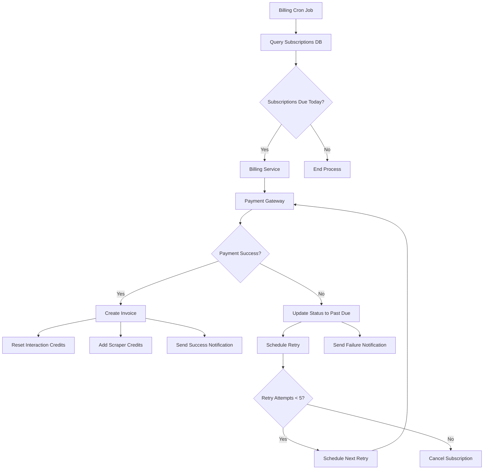

# Monthly Billing Cycle Implementation Plan

## Overview

This document outlines the implementation plan for the Monthly Billing Cycle automated system process. The system will handle subscription renewals, payment processing, credit allocation, and notification management.

## System Architecture

### Components

1. **Billing Cron Job** - Internal scheduler that runs daily to check for due subscriptions
2. **Billing Service** - Core service that orchestrates the renewal process
3. **Payment Gateway Integration** - iPaymu integration for payment processing
4. **Credit Management Service** - Handles credit reset and accumulation
5. **Notification Service** - Manages email notifications with invoice PDFs
6. **Retry Management** - Handles payment retry logic

### Flow Diagram



## Database Schema Changes

### New Tables

1. **payment_retries** - Track payment retry attempts
2. **billing_logs** - Log all billing operations for auditing

### New Functions

1. **reset_interaction_credits** - Reset interaction credits to new allocation
2. **add_scraper_credits** - Add scraper credits to existing balance
3. **schedule_payment_retry** - Schedule retry attempts
4. **cancel_subscription** - Cancel subscription after failed retries

## Implementation Details

### 1. Database Functions for Credit Management

#### reset_interaction_credits Function
```sql
CREATE OR REPLACE FUNCTION reset_interaction_credits(
  p_user_id TEXT,
  p_amount INTEGER,
  p_reference_id TEXT DEFAULT NULL,
  p_description TEXT DEFAULT NULL
)
RETURNS UUID AS $$
DECLARE
  transaction_id UUID;
  current_balance INTEGER;
BEGIN
  -- Get current balance
  current_balance := get_credit_balance(p_user_id, 'interaction');
  
  -- Create negative transaction to reset to zero
  INSERT INTO public.credit_ledger (
    user_id, credit_type, amount, balance_after, source, reference_id, description
  ) VALUES (
    p_user_id, 'interaction', -current_balance, 0, 'monthly_reset', p_reference_id, 
    COALESCE(p_description, 'Monthly interaction credits reset')
  ) RETURNING id INTO transaction_id;
  
  -- Add new allocation
  INSERT INTO public.credit_ledger (
    user_id, credit_type, amount, balance_after, source, reference_id, description
  ) VALUES (
    p_user_id, 'interaction', p_amount, p_amount, 'monthly_allocation', p_reference_id,
    COALESCE(p_description, 'Monthly interaction credits allocation')
  );
  
  RETURN transaction_id;
END;
$$ LANGUAGE plpgsql;
```

#### add_scraper_credits Function
```sql
CREATE OR REPLACE FUNCTION add_scraper_credits(
  p_user_id TEXT,
  p_amount INTEGER,
  p_reference_id TEXT DEFAULT NULL,
  p_description TEXT DEFAULT NULL
)
RETURNS UUID AS $$
DECLARE
  transaction_id UUID;
  current_balance INTEGER;
BEGIN
  -- Get current balance
  current_balance := get_credit_balance(p_user_id, 'scraper');
  
  -- Add new allocation to existing balance
  INSERT INTO public.credit_ledger (
    user_id, credit_type, amount, balance_after, source, reference_id, description
  ) VALUES (
    p_user_id, 'scraper', p_amount, current_balance + p_amount, 'monthly_allocation', p_reference_id,
    COALESCE(p_description, 'Monthly scraper credits allocation')
  ) RETURNING id INTO transaction_id;
  
  RETURN transaction_id;
END;
$$ LANGUAGE plpgsql;
```

### 2. Payment Retry Tracking Table

```sql
CREATE TABLE IF NOT EXISTS public.payment_retries (
  id UUID PRIMARY KEY DEFAULT gen_random_uuid(),
  subscription_id UUID NOT NULL REFERENCES public.subscriptions(id),
  attempt_number INTEGER NOT NULL,
  retry_date TIMESTAMP WITH TIME ZONE NOT NULL,
  status TEXT NOT NULL CHECK (status IN ('pending', 'processed', 'failed')),
  payment_response JSONB,
  created_at TIMESTAMP WITH TIME ZONE DEFAULT NOW(),
  updated_at TIMESTAMP WITH TIME ZONE DEFAULT NOW()
);

CREATE INDEX IF NOT EXISTS idx_payment_retries_subscription_id ON public.payment_retries(subscription_id);
CREATE INDEX IF NOT EXISTS idx_payment_retries_status ON public.payment_retries(status);
CREATE INDEX IF NOT EXISTS idx_payment_retries_retry_date ON public.payment_retries(retry_date);
```

### 3. iPaymu Payment Gateway Integration

#### Payment Service Implementation
```typescript
// src/lib/ipaymu-service.ts
export class IPaymuService {
  private apiKey: string;
  private isSandbox: boolean;

  constructor() {
    this.apiKey = process.env.IPAYMU_API_KEY || '';
    this.isSandbox = process.env.NODE_ENV !== 'production';
  }

  async createPayment(params: {
    amount: number;
    description: string;
    referenceId: string;
    customerEmail: string;
    customerName: string;
  }) {
    const url = this.isSandbox 
      ? 'https://sandbox.ipaymu.com/api/v2/payment'
      : 'https://my.ipaymu.com/api/v2/payment';

    const payload = {
      ...params,
      notifyUrl: `${process.env.NEXT_PUBLIC_APP_URL}/api/billing/webhook`,
      expired: '24', // 24 hours expiration
    };

    const response = await fetch(url, {
      method: 'POST',
      headers: {
        'Content-Type': 'application/json',
        'Authorization': `Bearer ${this.apiKey}`,
      },
      body: JSON.stringify(payload),
    });

    return response.json();
  }

  async checkPaymentStatus(transactionId: string) {
    const url = this.isSandbox
      ? `https://sandbox.ipaymu.com/api/v2/payment/${transactionId}`
      : `https://my.ipaymu.com/api/v2/payment/${transactionId}`;

    const response = await fetch(url, {
      method: 'GET',
      headers: {
        'Authorization': `Bearer ${this.apiKey}`,
      },
    });

    return response.json();
  }
}
```

### 4. Enhanced Billing Renewal Endpoint

The existing `/api/billing/renew` endpoint will be enhanced to:

1. Use iPaymu for payment processing
2. Implement proper retry logic
3. Handle credit reset and accumulation
4. Generate invoice PDFs
5. Send detailed notifications

### 5. Internal Cron Job Scheduler

```typescript
// src/lib/billing-scheduler.ts
export class BillingScheduler {
  private isRunning: boolean = false;

  async start() {
    // Run every day at midnight
    setInterval(async () => {
      if (!this.isRunning) {
        this.isRunning = true;
        try {
          await this.processDueSubscriptions();
          await this.processScheduledRetries();
        } catch (error) {
          console.error('Billing scheduler error:', error);
        } finally {
          this.isRunning = false;
        }
      }
    }, 24 * 60 * 60 * 1000); // 24 hours
  }

  private async processDueSubscriptions() {
    // Call the billing renewal endpoint
    const response = await fetch(`${process.env.NEXT_PUBLIC_APP_URL}/api/billing/renew`, {
      method: 'POST',
      headers: {
        'Authorization': `Bearer ${process.env.BILLING_CRON_SECRET}`,
      },
    });
    
    return response.json();
  }

  private async processScheduledRetries() {
    // Process scheduled payment retries
    const response = await fetch(`${process.env.NEXT_PUBLIC_APP_URL}/api/billing/retry`, {
      method: 'POST',
      headers: {
        'Authorization': `Bearer ${process.env.BILLING_CRON_SECRET}`,
      },
    });
    
    return response.json();
  }
}
```

### 6. Retry Logic Implementation

```typescript
// src/app/api/billing/retry/route.ts
export async function POST(request: NextRequest) {
  // Get all pending retries scheduled for today
  const today = new Date().toISOString().split('T')[0];
  
  const { data: pendingRetries, error } = await supabase
    .from('payment_retries')
    .select(`
      *,
      subscriptions!inner (
        *,
        subscription_plans (*),
        users!inner (email, name)
      )
    `)
    .eq('status', 'pending')
    .lte('retry_date', today)
    .order('retry_date', { ascending: true });

  if (error) {
    console.error('Error fetching pending retries:', error);
    return NextResponse.json({ error: 'Failed to fetch retries' }, { status: 500 });
  }

  const retryResults = [];

  for (const retry of pendingRetries || []) {
    try {
      // Process payment retry
      const paymentResult = await processPaymentRetry(retry);
      
      retryResults.push({
        retry_id: retry.id,
        subscription_id: retry.subscription_id,
        status: paymentResult.success ? 'success' : 'failed',
        attempt_number: retry.attempt_number,
      });

      // Update retry status
      await supabase
        .from('payment_retries')
        .update({
          status: paymentResult.success ? 'processed' : 'failed',
          payment_response: paymentResult.response,
          updated_at: new Date().toISOString(),
        })
        .eq('id', retry.id);

      // If payment failed and more retries are available, schedule next retry
      if (!paymentResult.success && retry.attempt_number < 5) {
        await scheduleNextRetry(retry.subscription_id, retry.attempt_number + 1);
      }

      // If all retries failed, cancel subscription
      if (!paymentResult.success && retry.attempt_number >= 5) {
        await cancelSubscription(retry.subscription_id);
      }

    } catch (error) {
      console.error(`Error processing retry ${retry.id}:`, error);
      retryResults.push({
        retry_id: retry.id,
        status: 'error',
        error: error instanceof Error ? error.message : 'Unknown error',
      });
    }
  }

  return NextResponse.json({
    processed: retryResults.length,
    results: retryResults,
  });
}
```

### 7. Notification System Enhancement

The notification system will be enhanced to:

1. Generate invoice PDFs using a library like PDFKit
2. Send emails with invoice attachments
3. Include detailed billing information
4. Handle payment failure notifications with retry information

### 8. Error Handling and Logging

```typescript
// src/lib/billing-logger.ts
export class BillingLogger {
  static async logBillingEvent(event: {
    type: 'renewal' | 'retry' | 'cancellation';
    subscriptionId: string;
    userId: string;
    status: 'success' | 'failed' | 'error';
    details: any;
    error?: string;
  }) {
    await supabase
      .from('billing_logs')
      .insert({
        event_type: event.type,
        subscription_id: event.subscriptionId,
        user_id: event.userId,
        status: event.status,
        details: event.details,
        error_message: event.error,
        created_at: new Date().toISOString(),
      });
  }
}
```

## Implementation Steps

1. **Database Schema Updates**
   - Create new tables and functions
   - Update existing tables if needed

2. **Payment Gateway Integration**
   - Implement iPaymu service
   - Create webhook handler for payment notifications

3. **Credit Management API**
   - Create endpoints for credit reset and accumulation
   - Implement database functions

4. **Enhanced Billing Service**
   - Update renewal endpoint with iPaymu integration
   - Implement retry logic
   - Add proper error handling

5. **Scheduler Implementation**
   - Create internal cron job scheduler
   - Initialize scheduler in the application

6. **Notification System**
   - Enhance email notifications
   - Implement invoice PDF generation

7. **Testing**
   - Create unit tests for all components
   - Implement integration tests
   - Test retry logic and edge cases

8. **Monitoring and Documentation**
   - Add logging and monitoring
   - Create documentation for setup and maintenance

## Security Considerations

1. **API Security**
   - Secure all billing endpoints with authentication
   - Use environment variables for sensitive data
   - Implement rate limiting for billing operations

2. **Payment Security**
   - Use HTTPS for all payment communications
   - Validate all payment responses
   - Implement proper error handling for payment failures

3. **Data Protection**
   - Encrypt sensitive payment information
   - Implement proper access controls
   - Log all billing operations for auditing

## Monitoring and Alerting

1. **Health Checks**
   - Monitor billing process execution
   - Track payment success rates
   - Monitor retry queue length

2. **Alerts**
   - Alert on payment failures
   - Notify on scheduler failures
   - Monitor subscription cancellation rates

3. **Reporting**
   - Daily billing reports
   - Monthly revenue reports
   - Failed payment analysis

## Deployment Considerations

1. **Environment Variables**
   - IPAYMU_API_KEY
   - BILLING_CRON_SECRET
   - NEXT_PUBLIC_APP_URL

2. **Database Migrations**
   - Run all schema migrations
   - Update existing data if needed

3. **Scheduler Initialization**
   - Start scheduler with application
   - Ensure proper error handling

This implementation plan provides a comprehensive solution for the Monthly Billing Cycle automated system process, addressing all requirements from the flow specification.