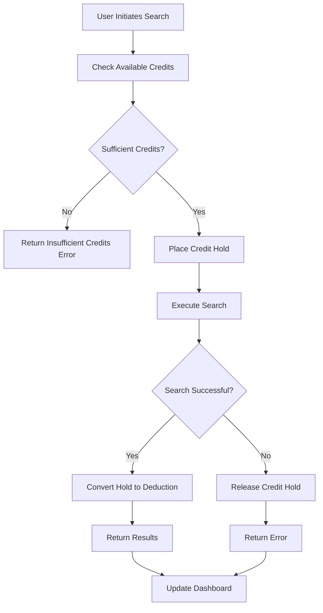

# Scraper Credit Usage (Lead Generation) Implementation Plan

## Executive Summary

This document provides a comprehensive implementation plan for the "Scraper Credit Usage (Lead Generation)" flow, which introduces a robust credit hold mechanism to prevent double-spending and improve transaction management during lead generation searches.

## Flow Overview

The new flow implements a three-phase credit management pattern:

1. **Hold Phase**: Temporarily reserve credits before executing searches
2. **Execution Phase**: Perform the actual lead generation
3. **Resolution Phase**: Convert holds to deductions (success) or release holds (failure)



## Implementation Components

### 1. Database Schema Enhancements

**New Table: Credit Holds**
- Tracks temporary credit reservations
- Includes status, expiration, and reference information
- Links to credit ledger transactions

**Enhanced Functions:**
- `hold_credits()` - Create temporary credit holds
- `convert_hold_to_deduction()` - Convert holds to permanent deductions
- `release_credit_hold()` - Release holds without deduction
- `get_available_credit_balance()` - Calculate available credits (total - held)
- `cleanup_expired_holds()` - Maintenance function for expired holds

### 2. API Endpoints

**Credit Management Endpoints:**
- `POST /api/credits/scraper/hold` - Place credit holds
- `POST /api/credits/scraper/deduct` - Convert holds to deductions
- `POST /api/credits/scraper/release-hold` - Release holds
- `GET /api/credits/balance` - Enhanced balance with held credits
- `GET /api/credits/scraper/holds` - List user's credit holds

**Enhanced Scraper Endpoint:**
- `POST /api/scraper/search` - Updated to use credit hold mechanism

### 3. Service Layer Updates

**User Service Enhancements:**
- Add credit hold management functions
- Implement proper error handling
- Add transaction logging

**Scraper Service Refactor:**
- Replace direct deduction with hold mechanism
- Improve error handling and recovery
- Add retry logic for transient failures

### 4. Frontend Updates

**Enhanced Credit Display:**
- Show total, held, and available credits
- Real-time updates during search operations
- Clear status indicators

**Improved User Experience:**
- Better search status feedback
- Enhanced error messages
- Credit usage transparency

## Implementation Phases

### Phase 1: Database Infrastructure (Week 1)
- [ ] Create credit_holds table migration
- [ ] Implement database functions
- [ ] Add indexes and RLS policies
- [ ] Test database operations

### Phase 2: API Development (Week 2)
- [ ] Implement credit hold endpoints
- [ ] Update balance endpoint
- [ ] Add comprehensive error handling
- [ ] Create integration tests

### Phase 3: Service Integration (Week 3)
- [ ] Update user service functions
- [ ] Refactor scraper search API
- [ ] Implement retry mechanisms
- [ ] Add structured logging

### Phase 4: Frontend Updates (Week 4)
- [ ] Update credit display components
- [ ] Enhance search status indicators
- [ ] Improve error messaging
- [ ] Add real-time updates

### Phase 5: Testing & Deployment (Week 5)
- [ ] Comprehensive testing
- [ ] Performance optimization
- [ ] Security review
- [ ] Gradual rollout

## Technical Specifications

### Database Schema

```sql
-- Credit holds table
CREATE TABLE public.credit_holds (
  id UUID PRIMARY KEY DEFAULT gen_random_uuid(),
  user_id TEXT NOT NULL REFERENCES public.users(clerk_id),
  credit_type TEXT NOT NULL CHECK (credit_type IN ('scraper', 'interaction')),
  amount INTEGER NOT NULL,
  reference_id TEXT NOT NULL,
  status TEXT NOT NULL CHECK (status IN ('active', 'converted', 'released', 'expired')),
  expires_at TIMESTAMP WITH TIME ZONE NOT NULL,
  created_at TIMESTAMP WITH TIME ZONE DEFAULT NOW(),
  updated_at TIMESTAMP WITH TIME ZONE DEFAULT NOW()
);

-- Enhanced credit ledger
ALTER TABLE public.credit_ledger 
ADD COLUMN hold_id UUID REFERENCES public.credit_holds(id);
```

### API Contract Examples

**Hold Credits Request:**
```json
{
  "amount": 50,
  "reference_id": "search-uuid",
  "expires_in_minutes": 60
}
```

**Hold Credits Response:**
```json
{
  "hold_id": "550e8400-e29b-41d4-a716-446655440000",
  "status": "active",
  "amount": 50,
  "expires_at": "2023-12-01T12:00:00Z"
}
```

**Enhanced Balance Response:**
```json
{
  "scraper_credits": {
    "total": 1000,
    "held": 50,
    "available": 950
  },
  "interaction_credits": {
    "total": 1500,
    "held": 0,
    "available": 1500
  }
}
```

### Error Handling

**Standard Error Format:**
```json
{
  "error": "Insufficient credits",
  "code": "INSUFFICIENT_CREDITS",
  "details": {
    "available_credits": 30,
    "required_credits": 50,
    "held_credits": 20
  }
}
```

## Security Considerations

### Authentication & Authorization
- Validate Clerk JWT tokens on all endpoints
- Ensure users can only access their own credit data
- Implement proper session management

### Data Protection
- Encrypt sensitive credit transaction data
- Implement audit logging for all credit operations
- Use parameterized queries to prevent SQL injection

### Rate Limiting
- Implement rate limiting for credit hold operations
- Prevent abuse of the credit system
- Monitor for unusual usage patterns

## Performance Optimization

### Database Optimization
- Add appropriate indexes for credit operations
- Implement connection pooling
- Use database transactions for atomicity

### Caching Strategy
- Cache credit balance information
- Implement TTL for cached data
- Invalidate cache on credit operations

### Scalability Considerations
- Design for concurrent credit operations
- Implement proper locking mechanisms
- Monitor database performance metrics

## Monitoring & Alerting

### Key Metrics
- Credit hold creation/conversion rates
- Search success/failure rates
- Credit usage patterns
- API response times

### Alert Conditions
- High failure rates for credit operations
- Unusual credit usage patterns
- Database performance degradation
- Long-running search operations

### Dashboards
- Real-time credit usage monitoring
- Hold lifecycle tracking
- User credit balance trends
- System performance metrics

## Testing Strategy

### Unit Tests
- Test all database functions
- Verify API endpoint behavior
- Test error handling scenarios
- Validate input sanitization

### Integration Tests
- Test complete credit hold flow
- Verify scraper service integration
- Test concurrent operations
- Validate error recovery mechanisms

### Load Tests
- Test performance under high load
- Verify concurrent credit operations
- Test database connection limits
- Validate system scalability

### Security Tests
- Test authentication mechanisms
- Verify authorization controls
- Test for common vulnerabilities
- Validate data protection measures

## Risk Mitigation

### Technical Risks
- **Database Deadlocks**: Implement proper transaction ordering
- **Race Conditions**: Use database locks and atomic operations
- **Performance Issues**: Implement caching and optimization

### Business Risks
- **Credit System Abuse**: Implement rate limiting and monitoring
- **User Experience**: Provide clear feedback and error messages
- **Data Integrity**: Implement comprehensive audit logging

### Operational Risks
- **Deployment Issues**: Use gradual rollout strategy
- **System Failures**: Implement retry mechanisms and fallbacks
- **Data Loss**: Implement regular backups and recovery procedures

## Success Criteria

### Functional Requirements
- [ ] Credit holds prevent double-spending
- [ ] Holds are properly converted or released
- [ ] Users see accurate credit information
- [ ] Search operations complete successfully

### Performance Requirements
- [ ] API response times < 500ms
- [ ] Support 100+ concurrent users
- [ ] 99.9% uptime for credit operations
- [ ] No data loss or corruption

### User Experience Requirements
- [ ] Clear credit usage information
- [ ] Helpful error messages
- [ ] Real-time status updates
- [ ] Intuitive search interface

## Rollback Plan

### Immediate Rollback Triggers
- Database corruption or data loss
- Security vulnerabilities
- Performance degradation > 50%
- User complaint rate > 10%

### Rollback Procedures
1. Switch to previous API implementation
2. Restore database from backup if needed
3. Monitor system stability
4. Communicate with stakeholders
5. Address issues before retry

### Post-Rollback Activities
- Root cause analysis
- Fix implementation issues
- Update testing procedures
- Improve monitoring and alerting

## Documentation Requirements

### Technical Documentation
- API endpoint documentation
- Database schema documentation
- Service architecture diagrams
- Deployment procedures

### User Documentation
- Updated user guides
- FAQ for credit system
- Troubleshooting guides
- Support procedures

### Operational Documentation
- Monitoring procedures
- Alert response plans
- Backup and recovery procedures
- Security guidelines

## Conclusion

This implementation plan provides a comprehensive approach to implementing the credit hold mechanism for the Scraper Service. The phased approach ensures minimal disruption to existing users while providing robust credit management capabilities.

The new system will:
- Prevent credit double-spending
- Improve transaction reliability
- Enhance user experience
- Provide better audit trails
- Support future scalability

Following this plan will result in a more reliable, secure, and user-friendly credit management system that supports the business requirements for lead generation services.