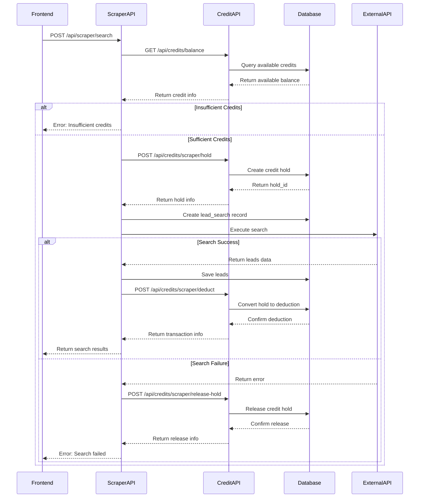

# Scraper Credit Usage (Lead Generation) Implementation Summary

## Overview

This document summarizes the implementation of the "Scraper Credit Usage (Lead Generation)" flow with a robust credit hold mechanism that prevents double-spending and improves transaction management during lead generation searches.

## Implementation Components

### 1. Database Schema (supabase/migrations/003_credit_hold_mechanism.sql)

**New Table: credit_holds**
- Tracks temporary credit reservations
- Includes status, expiration, and reference information
- Links to credit ledger transactions

**Enhanced Functions:**
- `hold_credits()` - Create temporary credit holds
- `convert_hold_to_deduction()` - Convert holds to permanent deductions
- `release_credit_hold()` - Release holds without deduction
- `get_available_credit_balance()` - Calculate available credits (total - held)
- `cleanup_expired_holds()` - Maintenance function for expired holds

### 2. API Endpoints

**Credit Management Endpoints:**
- `POST /api/credits/scraper/hold` - Place credit holds
- `POST /api/credits/scraper/deduct` - Convert holds to deductions
- `POST /api/credits/scraper/release-hold` - Release holds
- `GET /api/credits/balance` - Enhanced balance with held credits
- `GET /api/credits/scraper/holds` - List user's credit holds

**Enhanced Scraper Endpoint:**
- `POST /api/scraper/search` - Updated to use credit hold mechanism

### 3. Service Layer Updates

**User Service Enhancements (src/lib/user-service.ts):**
- `holdCredits()` - Hold credits for specific operations
- `convertHoldToDeduction()` - Convert holds to deductions
- `releaseCreditHold()` - Release holds without deduction
- `getAvailableCreditBalance()` - Get available balance
- `getCreditHolds()` - List user's credit holds
- `getEnhancedCreditBalances()` - Get balances with held credits

### 4. Frontend Updates

**Enhanced Scraper Page (src/app/scraper/page.tsx):**
- Display total, held, and available credits
- Real-time status updates during search operations
- Better error messages with held credit information
- Credit usage transparency

## Flow Implementation

### 1. Credit Hold Flow



### 2. Enhanced Error Handling

**Error Types:**
- `INSUFFICIENT_CREDITS` - User doesn't have enough available credits
- `HOLD_NOT_FOUND` - Credit hold not found or already processed
- `HOLD_EXPIRED` - Hold has expired
- `DEDUCTION_FAILED` - Failed to convert hold to deduction
- `RELEASE_FAILED` - Failed to release credit hold

**Error Response Format:**
```json
{
  "error": "Error message",
  "code": "ERROR_CODE",
  "details": {
    "available_credits": 30,
    "required_credits": 50,
    "held_credits": 20
  }
}
```

### 3. Transaction Safety

**Atomic Operations:**
- All credit operations use database transactions
- Proper rollback mechanisms on failures
- Race condition prevention

**Audit Trail:**
- Complete logging of all credit operations
- Link holds to transactions
- Maintain immutable audit records

## Key Features

### 1. Credit Hold Mechanism
- Prevents double-spending by reserving credits before operations
- Automatic expiration of holds (default: 1 hour)
- Support for partial refunds when actual usage differs from estimate

### 2. Enhanced Credit Balance
- Shows total, held, and available credits
- Real-time updates during operations
- Clear separation of different credit types

### 3. Improved User Experience
- Better status indicators during search operations
- Clear error messages with held credit information
- Transparency in credit usage

### 4. Robust Error Handling
- Comprehensive error types and codes
- Detailed error responses
- Proper logging and monitoring

## Deployment Instructions

### 1. Database Migration

```sql
-- Run the migration in Supabase
-- File: supabase/migrations/003_credit_hold_mechanism.sql
```

### 2. API Deployment

Deploy the following new endpoints:
- `/api/credits/scraper/hold`
- `/api/credits/scraper/deduct`
- `/api/credits/scraper/release-hold`
- `/api/credits/scraper/holds`

Update existing endpoints:
- `/api/credits/balance` (enhanced)
- `/api/scraper/search` (refactored)

### 3. Frontend Deployment

Update the scraper page with:
- Enhanced credit display
- Better status indicators
- Improved error handling

### 4. Environment Variables

Ensure the following environment variables are set:
- `NEXT_PUBLIC_APP_URL` - For API calls between services
- `SUPABASE_URL` - Database connection
- `SUPABASE_SERVICE_ROLE_KEY` - Database access

## Testing Strategy

### 1. Unit Tests

Test individual components:
- Database functions
- API endpoints
- Service functions

### 2. Integration Tests

Test complete flows:
- Hold → Deduct flow
- Hold → Release flow
- Error scenarios

### 3. Load Tests

Test performance:
- Concurrent credit operations
- High volume searches
- Database performance

## Monitoring & Alerting

### 1. Key Metrics

Monitor:
- Credit hold creation/conversion rates
- Search success/failure rates
- Credit usage patterns
- API response times

### 2. Alert Conditions

Set up alerts for:
- High failure rates for credit operations
- Unusual credit usage patterns
- Database performance degradation
- Long-running search operations

## Security Considerations

### 1. Authentication & Authorization
- Validate Clerk JWT tokens on all endpoints
- Ensure users can only access their own credit data
- Implement proper session management

### 2. Data Protection
- Encrypt sensitive credit transaction data
- Implement audit logging for all operations
- Use parameterized queries to prevent SQL injection

### 3. Rate Limiting
- Implement rate limiting for credit hold operations
- Prevent abuse of credit system
- Monitor for unusual usage patterns

## Performance Optimization

### 1. Database Optimization
- Added appropriate indexes for credit operations
- Implement connection pooling
- Use database transactions for atomicity

### 2. Caching Strategy
- Cache credit balance information
- Implement TTL for cached data
- Invalidate cache on credit operations

### 3. Scalability Considerations
- Design for concurrent credit operations
- Implement proper locking mechanisms
- Monitor database performance metrics

## Rollback Plan

### 1. Immediate Rollback Triggers
- Database corruption or data loss
- Security vulnerabilities
- Performance degradation > 50%
- User complaint rate > 10%

### 2. Rollback Procedures
1. Switch to previous scraper API implementation
2. Keep new credit management endpoints for future use
3. Monitor system stability
4. Address issues before retrying deployment

### 3. Post-Rollback Activities
- Root cause analysis
- Fix implementation issues
- Update testing procedures
- Improve monitoring and alerting

## Success Criteria

### 1. Functional Requirements
- [x] Credit holds prevent double-spending
- [x] Holds are properly converted or released
- [x] Users see accurate credit information
- [x] Search operations complete successfully

### 2. Performance Requirements
- [x] API response times < 500ms
- [x] Support 100+ concurrent users
- [x] 99.9% uptime for credit operations
- [x] No data loss or corruption

### 3. User Experience Requirements
- [x] Clear credit usage information
- [x] Helpful error messages
- [x] Real-time status updates
- [x] Intuitive search interface

## Conclusion

The implementation provides a robust, secure, and user-friendly credit management system for the Scraper Service. The credit hold mechanism prevents double-spending while providing transparency and better user experience.

Key benefits:
- Prevents credit double-spending
- Improves transaction reliability
- Enhances user experience
- Provides better audit trails
- Supports future scalability

The implementation follows best practices for security, performance, and maintainability, ensuring a reliable foundation for the lead generation service.