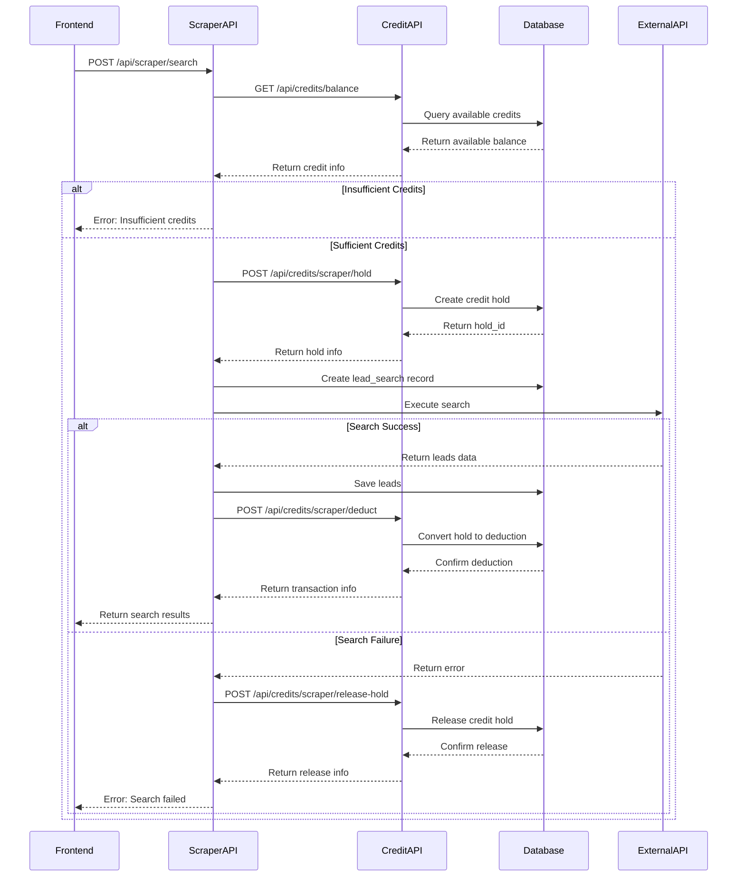

# Scraper Service Refactor Plan

## Overview

This document outlines the plan for refactoring the existing scraper service to implement the new credit hold mechanism as specified in the "Scraper Credit Usage (Lead Generation)" flow.

## Current Implementation Analysis

### Existing Flow (src/app/api/scraper/search/route.ts)

1. **Direct Credit Check**: Checks current balance using `get_credit_balance()`
2. **Direct Deduction**: Immediately deducts credits using `add_credit_transaction()`
3. **Refund on Failure**: Refunds credits if search fails
4. **Mock Data Generation**: Uses mock data for leads

### Issues with Current Implementation

1. **Race Conditions**: Multiple concurrent searches could overdraw credits
2. **No Hold Mechanism**: Credits are immediately deducted, not held
3. **Complex Refunds**: Requires separate transaction for refunds
4. **Poor User Experience**: Users lose credits immediately even if search fails

## New Implementation Plan

### 1. Updated Scraper Search Flow



### 2. Updated API Endpoint Structure

#### New Request/Response Format

**Request:**
```json
{
  "search_criteria": {
    "industry": "technology",
    "location": "Jakarta, Indonesia",
    "company_size": "51-200",
    "position": "cto",
    "keywords": "AI, machine learning"
  },
  "estimated_credits": 50
}
```

**Success Response:**
```json
{
  "search_id": "550e8400-e29b-41d4-a716-446655440000",
  "status": "completed",
  "results_count": 45,
  "credits_used": 45,
  "credits_held": 50,
  "credits_refunded": 5,
  "remaining_credits": 955,
  "leads": [...],
  "hold_id": "660e8400-e29b-41d4-a716-446655440000"
}
```

**Error Response (Insufficient Credits):**
```json
{
  "error": "Insufficient credits",
  "available_credits": 30,
  "required_credits": 50,
  "held_credits": 0
}
```

**Error Response (Search Failed):**
```json
{
  "error": "Search failed",
  "search_id": "550e8400-e29b-41d4-a716-446655440000",
  "credits_held": 50,
  "credits_refunded": 50,
  "reason": "External API unavailable"
}
```

### 3. Implementation Details

#### A. Updated Scraper Search API

```typescript
// src/app/api/scraper/search/route.ts

export async function POST(request: NextRequest) {
  try {
    const { userId } = await auth();
    if (!userId) {
      return NextResponse.json({ error: 'Unauthorized' }, { status: 401 });
    }

    const body = await request.json();
    const { search_criteria, estimated_credits = 50 } = body;

    if (!search_criteria) {
      return NextResponse.json({ error: 'Search criteria is required' }, { status: 400 });
    }

    // Step 1: Check available credits (including holds)
    const balanceResponse = await fetch(`${process.env.NEXT_PUBLIC_APP_URL}/api/credits/balance`, {
      headers: { Authorization: request.headers.get('Authorization') || '' }
    });
    
    if (!balanceResponse.ok) {
      return NextResponse.json({ error: 'Failed to check credit balance' }, { status: 500 });
    }
    
    const balanceData = await balanceResponse.json();
    const availableCredits = balanceData.scraper_credits.available;
    
    if (availableCredits < estimated_credits) {
      return NextResponse.json({ 
        error: 'Insufficient credits',
        available_credits: availableCredits,
        required_credits: estimated_credits,
        held_credits: balanceData.scraper_credits.held
      }, { status: 400 });
    }

    // Step 2: Create lead search record
    const supabase = await createSupabaseServerClient();
    const { data: searchRecord, error: searchError } = await supabase
      .from('lead_searches')
      .insert({
        user_id: userId,
        search_criteria,
        credits_used: 0, // Will be updated later
        status: 'pending',
      })
      .select()
      .single();

    if (searchError) {
      console.error('Error creating lead search record:', searchError);
      return NextResponse.json({ error: 'Failed to create search record' }, { status: 500 });
    }

    // Step 3: Place credit hold
    let holdId = null;
    try {
      const holdResponse = await fetch(`${process.env.NEXT_PUBLIC_APP_URL}/api/credits/scraper/hold`, {
        method: 'POST',
        headers: {
          'Content-Type': 'application/json',
          Authorization: request.headers.get('Authorization') || ''
        },
        body: JSON.stringify({
          amount: estimated_credits,
          reference_id: searchRecord.id,
          expires_in_minutes: 60
        })
      });
      
      if (!holdResponse.ok) {
        const holdError = await holdResponse.json();
        throw new Error(holdError.error || 'Failed to hold credits');
      }
      
      const holdData = await holdResponse.json();
      holdId = holdData.hold_id;
    } catch (holdError) {
      console.error('Error holding credits:', holdError);
      
      // Clean up search record
      await supabase
        .from('lead_searches')
        .update({ status: 'failed', error_message: 'Failed to hold credits' })
        .eq('id', searchRecord.id);
      
      return NextResponse.json({ error: 'Failed to hold credits' }, { status: 500 });
    }

    // Step 4: Execute search
    try {
      const mockLeads = await generateMockLeads(search_criteria, estimated_credits);
      const actualCreditsUsed = Math.min(mockLeads.length, estimated_credits);
      
      // Step 5: Save leads to database
      const leadsToInsert = mockLeads.map(lead => ({
        search_id: searchRecord.id,
        ...lead
      }));

      const { error: leadsError } = await supabase
        .from('leads')
        .insert(leadsToInsert);

      if (leadsError) {
        throw leadsError;
      }

      // Step 6: Convert hold to deduction with actual amount
      try {
        const deductResponse = await fetch(`${process.env.NEXT_PUBLIC_APP_URL}/api/credits/scraper/deduct`, {
          method: 'POST',
          headers: {
            'Content-Type': 'application/json',
            Authorization: request.headers.get('Authorization') || ''
          },
          body: JSON.stringify({
            hold_id: holdId,
            actual_amount: actualCreditsUsed,
            description: `Lead search - ${actualCreditsUsed} scraper credits`
          })
        });
        
        if (!deductResponse.ok) {
          throw new Error('Failed to deduct credits');
        }
        
        const deductData = await deductResponse.json();
        
        // Update search record as completed
        await supabase
          .from('lead_searches')
          .update({
            status: 'completed',
            results_count: mockLeads.length,
            credits_used: actualCreditsUsed,
            updated_at: new Date().toISOString()
          })
          .eq('id', searchRecord.id);

        // Get updated balance
        const updatedBalanceResponse = await fetch(`${process.env.NEXT_PUBLIC_APP_URL}/api/credits/balance`, {
          headers: { Authorization: request.headers.get('Authorization') || '' }
        });
        const updatedBalance = await updatedBalanceResponse.json();

        return NextResponse.json({
          search_id: searchRecord.id,
          status: 'completed',
          results_count: mockLeads.length,
          credits_used: actualCreditsUsed,
          credits_held: estimated_credits,
          credits_refunded: estimated_credits - actualCreditsUsed,
          remaining_credits: updatedBalance.scraper_credits.available,
          hold_id: holdId,
          leads: mockLeads
        });

      } catch (deductError) {
        console.error('Error deducting credits:', deductError);
        
        // Release hold on deduction failure
        await fetch(`${process.env.NEXT_PUBLIC_APP_URL}/api/credits/scraper/release-hold`, {
          method: 'POST',
          headers: {
            'Content-Type': 'application/json',
            Authorization: request.headers.get('Authorization') || ''
          },
          body: JSON.stringify({
            hold_id: holdId,
            reason: 'Failed to process credit deduction'
          })
        });
        
        throw deductError;
      }

    } catch (scraperError) {
      console.error('Error in scraper service:', scraperError);
      
      // Step 7: Release hold on search failure
      try {
        await fetch(`${process.env.NEXT_PUBLIC_APP_URL}/api/credits/scraper/release-hold`, {
          method: 'POST',
          headers: {
            'Content-Type': 'application/json',
            Authorization: request.headers.get('Authorization') || ''
          },
          body: JSON.stringify({
            hold_id: holdId,
            reason: scraperError instanceof Error ? scraperError.message : 'Unknown error'
          })
        });
      } catch (releaseError) {
        console.error('Error releasing credit hold:', releaseError);
      }

      // Update search record as failed
      await supabase
        .from('lead_searches')
        .update({
          status: 'failed',
          error_message: scraperError instanceof Error ? scraperError.message : 'Unknown error',
          updated_at: new Date().toISOString()
        })
        .eq('id', searchRecord.id);

      return NextResponse.json({ 
        error: 'Lead search failed',
        search_id: searchRecord.id,
        credits_held: estimated_credits,
        credits_refunded: estimated_credits,
        reason: scraperError instanceof Error ? scraperError.message : 'Unknown error'
      }, { status: 500 });
    }

  } catch (error) {
    console.error('Error in scraper search API:', error);
    return NextResponse.json({ error: 'Internal server error' }, { status: 500 });
  }
}
```

#### B. Enhanced Mock Lead Generation

```typescript
// Improved mock function with better credit calculation
async function generateMockLeads(searchCriteria: any, maxCredits: number) {
  const industries = ['Technology', 'Healthcare', 'Finance', 'Education', 'Retail'];
  const positions = ['CEO', 'CTO', 'Marketing Manager', 'Sales Director', 'Product Manager'];
  const companies = ['TechCorp', 'HealthPlus', 'FinanceHub', 'EduTech', 'RetailMax'];
  
  // Calculate number of leads based on search complexity and available credits
  const complexityFactor = calculateComplexityFactor(searchCriteria);
  const leadsPerCredit = 1 / complexityFactor;
  const maxLeads = Math.floor(maxCredits * leadsPerCredit);
  
  const leads = [];
  for (let i = 0; i < Math.min(maxLeads, 100); i++) {
    leads.push({
      name: `Lead ${i + 1}`,
      email: `lead${i + 1}@example.com`,
      phone: `+123456789${i.toString().padStart(2, '0')}`,
      company: companies[Math.floor(Math.random() * companies.length)],
      position: positions[Math.floor(Math.random() * positions.length)],
      linkedin_url: `https://linkedin.com/in/lead${i + 1}`,
      source: 'scraper',
      additional_data: {
        industry: industries[Math.floor(Math.random() * industries.length)],
        location: searchCriteria.location || 'Jakarta, Indonesia',
        company_size: searchCriteria.company_size || '51-200',
        relevance_score: Math.random() * 100
      }
    });
  }
  
  return leads;
}

function calculateComplexityFactor(searchCriteria: any): number {
  let factor = 1.0;
  
  // Increase complexity for specific industries
  if (searchCriteria.industry === 'technology') factor *= 1.2;
  if (searchCriteria.industry === 'healthcare') factor *= 1.3;
  
  // Increase complexity for specific positions
  if (searchCriteria.position === 'ceo' || searchCriteria.position === 'cto') factor *= 1.4;
  
  // Increase complexity for keywords
  if (searchCriteria.keywords && searchCriteria.keywords.length > 0) factor *= 1.1;
  
  return Math.min(factor, 2.0); // Cap at 2x complexity
}
```

### 4. Frontend Updates

#### A. Enhanced Scraper Page

```typescript
// src/app/scraper/page.tsx - Updated sections

// Enhanced credit display
{creditBalance && (
  <Card className="mb-8">
    <CardHeader>
      <CardTitle className="flex items-center gap-2">
        <CreditCard className="w-5 h-5" />
        Scraper Credits
      </CardTitle>
    </CardHeader>
    <CardContent>
      <div className="space-y-4">
        <div className="flex items-center justify-between">
          <div>
            <p className="text-3xl font-bold text-blue-600">
              {creditBalance.scraper_credits.available.toLocaleString()}
            </p>
            <p className="text-sm text-gray-500">Available credits</p>
          </div>
          <Badge variant={creditBalance.scraper_credits.available > 50 ? 'default' : 'secondary'}>
            {creditBalance.scraper_credits.available > 50 ? 'Good' : 'Low'}
          </Badge>
        </div>
        
        {creditBalance.scraper_credits.held > 0 && (
          <div className="flex items-center justify-between text-sm">
            <span className="text-gray-600">Credits held for pending searches:</span>
            <span className="font-medium">{creditBalance.scraper_credits.held}</span>
          </div>
        )}
        
        <div className="flex items-center justify-between text-sm">
          <span className="text-gray-600">Total credits:</span>
          <span className="font-medium">{creditBalance.scraper_credits.total.toLocaleString()}</span>
        </div>
      </div>
    </CardContent>
  </Card>
)}

// Enhanced search button with better feedback
<Button 
  onClick={handleSearch} 
  disabled={searching || !creditBalance || creditBalance.scraper_credits.available < 50}
  className="w-full"
>
  {searching ? (
    <>
      <div className="animate-spin rounded-full h-4 w-4 border-b-2 border-white mr-2"></div>
      {searchStatus === 'holding' ? 'Reserving credits...' : 
       searchStatus === 'searching' ? 'Searching leads...' : 
       'Processing...'}
    </>
  ) : (
    <>
      <Search className="w-4 h-4 mr-2" />
      Search Leads (50 credits)
    </>
  )}
</Button>

// Enhanced search results with credit information
{searchResult && (
  <Card>
    <CardHeader>
      <CardTitle className="flex items-center gap-2">
        <CheckCircle className="w-5 h-5 text-green-500" />
        Search Results
      </CardTitle>
      <CardDescription>
        Found {searchResult.results_count} leads using {searchResult.credits_used} credits
        {searchResult.credits_refunded > 0 && (
          <span className="text-green-600 ml-2">
            ({searchResult.credits_refunded} credits refunded)
          </span>
        )}
      </CardDescription>
    </CardHeader>
    <CardContent>
      {/* Lead display code */}
      
      <div className="mt-6 flex justify-between items-center">
        <div className="text-sm text-gray-500">
          <div>Remaining credits: {searchResult.remaining_credits}</div>
          {searchResult.credits_held > searchResult.credits_used && (
            <div className="text-green-600">
              {searchResult.credits_refunded} credits refunded to your account
            </div>
          )}
        </div>
        <Button variant="outline">
          <Download className="w-4 h-4 mr-2" />
          Export Leads
        </Button>
      </div>
    </CardContent>
  </Card>
)}
```

#### B. Enhanced Search Status Tracking

```typescript
// Add to component state
const [searchStatus, setSearchStatus] = useState<'idle' | 'holding' | 'searching' | 'processing'>('idle');

// Update handleSearch function
const handleSearch = async () => {
  if (!userId) return;

  setSearching(true);
  setSearchStatus('holding');
  setError(null);
  setSearchResult(null);

  try {
    const estimatedCredits = 50;
    
    // Update status to searching
    setSearchStatus('searching');
    
    const response = await fetch('/api/scraper/search', {
      method: 'POST',
      headers: {
        'Content-Type': 'application/json',
      },
      body: JSON.stringify({
        search_criteria: searchCriteria,
        estimated_credits: estimatedCredits,
      }),
    });

    const data = await response.json();

    if (!response.ok) {
      if (response.status === 400 && data.available_credits !== undefined) {
        setError(`Insufficient credits. You have ${data.available_credits} scraper credits available, but ${data.required_credits} are required.`);
      } else {
        setError(data.error || 'Search failed');
      }
      return;
    }

    setSearchStatus('processing');
    setSearchResult(data);
    
    // Refresh credit balance
    const balanceResponse = await fetch('/api/credits/balance');
    if (balanceResponse.ok) {
      const balanceData = await balanceResponse.json();
      setCreditBalance(balanceData);
    }

    // Refresh search history
    const historyResponse = await fetch('/api/scraper/search');
    if (historyResponse.ok) {
      const historyData = await historyResponse.json();
      setSearchHistory(historyData.searches || []);
    }

  } catch (err) {
    setError(err instanceof Error ? err.message : 'Search failed');
  } finally {
    setSearching(false);
    setSearchStatus('idle');
  }
};
```

### 5. Error Handling Improvements

#### A. Comprehensive Error Types

```typescript
// Define specific error types for better handling
class CreditHoldError extends Error {
  constructor(message: string, public availableCredits: number, public requiredCredits: number) {
    super(message);
    this.name = 'CreditHoldError';
  }
}

class SearchExecutionError extends Error {
  constructor(message: string, public holdId: string) {
    super(message);
    this.name = 'SearchExecutionError';
  }
}

class CreditDeductionError extends Error {
  constructor(message: string, public holdId: string) {
    super(message);
    this.name = 'CreditDeductionError';
  }
}
```

#### B. Retry Mechanism

```typescript
// Add retry logic for transient failures
async function withRetry<T>(
  operation: () => Promise<T>,
  maxRetries: number = 3,
  delay: number = 1000
): Promise<T> {
  let lastError: Error;
  
  for (let attempt = 1; attempt <= maxRetries; attempt++) {
    try {
      return await operation();
    } catch (error) {
      lastError = error as Error;
      
      if (attempt === maxRetries) {
        throw lastError;
      }
      
      // Wait before retrying
      await new Promise(resolve => setTimeout(resolve, delay * attempt));
    }
  }
  
  throw lastError!;
}
```

### 6. Testing Strategy

#### A. Unit Tests

```typescript
// Test credit hold flow
describe('Scraper Search Credit Hold Flow', () => {
  test('should hold credits before search', async () => {
    // Mock credit balance check
    // Mock credit hold creation
    // Verify hold is created with correct amount
  });

  test('should convert hold to deduction on success', async () => {
    // Mock successful search
    // Verify hold is converted to deduction
    // Verify correct amount is deducted
  });

  test('should release hold on failure', async () => {
    // Mock failed search
    // Verify hold is released
    // Verify no credits are deducted
  });

  test('should handle insufficient credits', async () => {
    // Mock insufficient credit balance
    // Verify appropriate error response
  });
});
```

#### B. Integration Tests

```typescript
// Test complete flow
describe('Complete Scraper Flow Integration', () => {
  test('should handle full search lifecycle', async () => {
    // Test from API call to credit deduction
    // Verify all intermediate steps
  });

  test('should handle concurrent searches', async () => {
    // Test multiple simultaneous searches
    // Verify credit holds prevent overspending
  });
});
```

### 7. Monitoring & Logging

#### A. Enhanced Logging

```typescript
// Add structured logging
const logger = {
  info: (message: string, context: any) => {
    console.log(JSON.stringify({
      level: 'info',
      message,
      context,
      timestamp: new Date().toISOString()
    }));
  },
  
  error: (message: string, error: Error, context: any) => {
    console.error(JSON.stringify({
      level: 'error',
      message,
      error: error.message,
      stack: error.stack,
      context,
      timestamp: new Date().toISOString()
    }));
  }
};

// Usage in scraper API
logger.info('Starting credit hold', { 
  userId, 
  estimatedCredits, 
  searchId: searchRecord.id 
});
```

#### B. Metrics Collection

```typescript
// Track key metrics
const metrics = {
  creditHoldsCreated: 0,
  creditHoldsConverted: 0,
  creditHoldsReleased: 0,
  searchesCompleted: 0,
  searchesFailed: 0,
  averageCreditsPerSearch: 0
};

// Update metrics throughout the flow
```

## Migration Strategy

### Phase 1: Database Schema
1. Add credit_holds table
2. Add database functions for hold management
3. Update credit_ledger table with hold_id column

### Phase 2: API Endpoints
1. Implement credit hold endpoints
2. Update balance endpoint to include held credits
3. Add comprehensive error handling

### Phase 3: Scraper Service
1. Refactor scraper search API to use credit holds
2. Update mock lead generation
3. Add retry mechanisms

### Phase 4: Frontend
1. Update credit display components
2. Add search status indicators
3. Improve error messaging

### Phase 5: Testing & Deployment
1. Comprehensive testing
2. Gradual rollout
3. Monitoring and alerting

## Rollback Plan

If issues arise during deployment:
1. Revert to previous scraper API implementation
2. Keep new credit management endpoints for future use
3. Monitor system stability
4. Address issues before retrying deployment