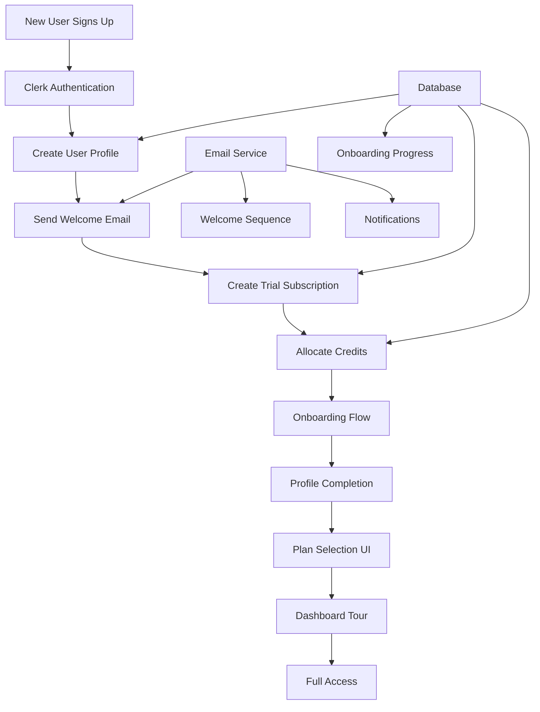

# User Onboarding & Subscription Selection Flow Implementation Plan

## Overview
This document outlines the implementation plan for enhancing the User Onboarding & Subscription Selection flow in the AI Marketing Platform. The current system has basic authentication and trial subscription creation, but lacks a comprehensive onboarding experience with email notifications and user guidance.

## Current State Analysis
- ✅ Clerk authentication is implemented
- ✅ Basic user profile creation exists
- ✅ Trial subscription creation is functional
- ✅ Credit allocation system works
- ❌ No email service integration
- ❌ No onboarding flow for new users
- ❌ No profile completion steps
- ❌ No welcome email sequence
- ❌ No plan selection UI for new users

## Implementation Architecture



## Phase 1: Email Service Integration

### 1.1 Install Resend
```bash
npm install resend
```

### 1.2 Create Email Service
- File: `src/lib/email-service.ts`
- Configure Resend client
- Implement email sending functions
- Add error handling and logging

### 1.3 Environment Variables
```env
RESEND_API_KEY=your_resend_api_key
FROM_EMAIL=noreply@yourdomain.com
APP_URL=http://localhost:3000
```

## Phase 2: Email Templates

### 2.1 Welcome Email Template
- File: `src/emails/welcome-email.tsx`
- Personalized with user name
- Include trial information
- Call-to-action to complete profile

### 2.2 Email Verification Template
- File: `src/emails/verify-email.tsx`
- Secure verification link
- Expiration time handling

### 2.3 Subscription Notification Templates
- Trial activation confirmation
- Plan upgrade notifications
- Credit low warnings

## Phase 3: Enhanced Notification Service

### 3.1 Update Notification API
- File: `src/app/api/notifications/send/route.ts`
- Integrate with email service
- Queue email sending
- Track delivery status

### 3.2 Email Delivery Tracking
- Update database schema for email tracking
- Add delivery status columns
- Implement retry logic

## Phase 4: User Profile Completion Flow

### 4.1 Profile Completion Page
- File: `src/app/onboarding/profile/page.tsx`
- Multi-step form
- Progress indicator
- Field validation

### 4.2 Profile Completion API
- File: `src/app/api/onboarding/profile/route.ts`
- Handle profile updates
- Track completion progress
- Trigger next onboarding step

## Phase 5: Post-Registration Onboarding

### 5.1 Onboarding Flow Controller
- File: `src/app/onboarding/page.tsx`
- Step-by-step wizard
- Progress tracking
- Skip option for returning users

### 5.2 Onboarding Steps
1. Welcome & Introduction
2. Profile Completion
3. Plan Selection
4. Dashboard Tour
5. First Action Guide

## Phase 6: Plan Selection UI

### 6.1 Plan Selection Page
- File: `src/app/onboarding/plans/page.tsx`
- Interactive plan comparison
- Highlight recommended plan
- Upgrade flow integration

### 6.2 Plan Selection API
- File: `src/app/api/onboarding/select-plan/route.ts`
- Handle plan selection
- Create subscription
- Redirect to billing if needed

## Phase 7: Onboarding Progress Tracking

### 7.1 Progress Tracking System
- Database table: `onboarding_progress`
- Track completed steps
- Store user preferences
- Handle abandoned onboarding

### 7.2 Progress API
- File: `src/app/api/onboarding/progress/route.ts`
- Get/update progress
- Mark steps complete
- Calculate completion percentage

## Phase 8: Email Verification Flow

### 8.1 Verification Page
- File: `src/app/verify-email/page.tsx`
- Handle verification tokens
- Show success/error states
- Auto-redirect after verification

### 8.2 Verification API
- File: `src/app/api/auth/verify-email/route.ts`
- Generate verification tokens
- Validate tokens
- Update user email status

## Phase 9: Welcome Email Sequence

### 9.1 Email Sequence Scheduler
- File: `src/lib/email-sequence.ts`
- Day 0: Welcome email
- Day 2: Getting started tips
- Day 5: Feature highlights
- Day 7: Trial expiration reminder

### 9.2 Sequence Automation
- Background job processing
- User segmentation
- Unsubscribe handling

## Phase 10: Dashboard Onboarding Tour

### 10.1 Tour Component
- File: `src/components/onboarding/tour.tsx`
- Step-by-step highlights
- Interactive tooltips
- Progress tracking

### 10.2 Tour Integration
- File: `src/app/dashboard/page.tsx`
- Show for new users
- Dismiss option
- Resume capability

## Database Schema Updates

### New Tables

```sql
-- Email tracking
CREATE TABLE email_logs (
  id UUID PRIMARY KEY DEFAULT gen_random_uuid(),
  user_id TEXT REFERENCES users(clerk_id),
  template_name TEXT NOT NULL,
  recipient_email TEXT NOT NULL,
  status TEXT NOT NULL CHECK (status IN ('pending', 'sent', 'delivered', 'failed')),
  error_message TEXT,
  sent_at TIMESTAMP WITH TIME ZONE,
  created_at TIMESTAMP WITH TIME ZONE DEFAULT NOW()
);

-- Onboarding progress
CREATE TABLE onboarding_progress (
  id UUID PRIMARY KEY DEFAULT gen_random_uuid(),
  user_id TEXT REFERENCES users(clerk_id) ON DELETE CASCADE,
  current_step TEXT NOT NULL,
  completed_steps TEXT[] DEFAULT '{}',
  is_completed BOOLEAN DEFAULT false,
  last_updated_at TIMESTAMP WITH TIME ZONE DEFAULT NOW(),
  created_at TIMESTAMP WITH TIME ZONE DEFAULT NOW()
);

-- Email verification tokens
CREATE TABLE email_verification_tokens (
  id UUID PRIMARY KEY DEFAULT gen_random_uuid(),
  user_id TEXT REFERENCES users(clerk_id) ON DELETE CASCADE,
  token TEXT UNIQUE NOT NULL,
  expires_at TIMESTAMP WITH TIME ZONE NOT NULL,
  is_used BOOLEAN DEFAULT false,
  created_at TIMESTAMP WITH TIME ZONE DEFAULT NOW()
);
```

## Implementation Priority

### High Priority (Week 1)
1. Email Service Integration
2. Welcome Email Template
3. Enhanced Notification Service
4. Basic Profile Completion Flow

### Medium Priority (Week 2)
5. Onboarding Progress Tracking
6. Email Verification Flow
7. Plan Selection UI
8. Post-Registration Onboarding Steps

### Low Priority (Week 3)
9. Welcome Email Sequence
10. Dashboard Onboarding Tour
11. Advanced Analytics
12. A/B Testing Framework

## Success Metrics

- User onboarding completion rate: Target 80%
- Profile completion rate: Target 90%
- Email open rate: Target 60%
- Trial to paid conversion: Target 25%
- Time to first value: Target < 5 minutes

## Testing Strategy

### Unit Tests
- Email service functions
- Onboarding logic
- Form validation

### Integration Tests
- Email sending flow
- Database operations
- API endpoints

### E2E Tests
- Complete onboarding flow
- Email verification
- Plan selection

## Security Considerations

- Email verification token security
- Rate limiting on email sending
- User data protection
- CSRF protection on forms

## Performance Optimizations

- Email queue processing
- Database query optimization
- Lazy loading of onboarding components
- Caching of user progress

## Monitoring & Analytics

- Email delivery metrics
- Onboarding funnel analysis
- User engagement tracking
- Error monitoring and alerting