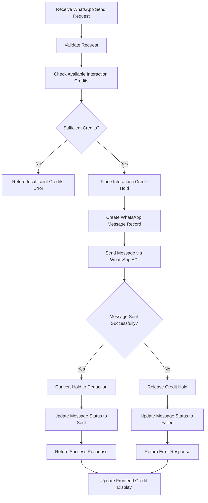

# WhatsApp Credit Hold Implementation Guide

## Overview

This guide provides detailed implementation instructions for updating the WhatsApp send route to use the interaction credit hold mechanism. This ensures consistency with the scraper credit implementation and prevents double-spending of interaction credits.

## Current Implementation Analysis

The current WhatsApp send route (`/api/whatsapp/send/route.ts`) already implements basic credit checking and deduction, but it doesn't use the credit hold mechanism. The current flow is:

1. Check available interaction credits
2. Create WhatsApp message record
3. Deduct credits immediately
4. Send message via WhatsApp API
5. Refund credits on failure

## Updated Implementation Flow

The new implementation will follow this enhanced flow:



## Implementation Steps

### Step 1: Update Import Statements

Add the necessary imports for the interaction credit endpoints:

```typescript
// Add these imports at the top of the file
import { holdInteractionCredits } from '@/lib/interaction-credit-service';
import { deductInteractionCredits } from '@/lib/interaction-credit-service';
import { releaseInteractionCreditHold } from '@/lib/interaction-credit-service';
```

### Step 2: Create Interaction Credit Service

Create a new service file to handle interaction credit operations:

```typescript
// src/lib/interaction-credit-service.ts
import { createSupabaseServerClient } from '@/lib/supabase';

export async function holdInteractionCredits(
  userId: string,
  amount: number,
  referenceId: string,
  expiresInMinutes: number = 30
) {
  const supabase = await createSupabaseServerClient();
  
  const { data: holdId, error } = await supabase.rpc('hold_credits', {
    p_user_id: userId,
    p_credit_type: 'interaction',
    p_amount: amount,
    p_reference_id: referenceId,
    p_expires_in_minutes: expiresInMinutes
  });

  if (error) {
    throw new Error(`Failed to hold credits: ${error.message}`);
  }

  return holdId;
}

export async function deductInteractionCredits(
  holdId: string,
  description?: string
) {
  const supabase = await createSupabaseServerClient();
  
  const { data: transactionId, error } = await supabase.rpc('convert_hold_to_deduction', {
    p_hold_id: holdId,
    p_description: description
  });

  if (error) {
    throw new Error(`Failed to deduct credits: ${error.message}`);
  }

  return transactionId;
}

export async function releaseInteractionCreditHold(
  holdId: string,
  reason?: string
) {
  const supabase = await createSupabaseServerClient();
  
  const { error } = await supabase.rpc('release_credit_hold', {
    p_hold_id: holdId,
    p_reason: reason
  });

  if (error) {
    throw new Error(`Failed to release credit hold: ${error.message}`);
  }

  return true;
}
```

### Step 3: Update WhatsApp Send Route

Replace the current credit checking and deduction logic with the credit hold mechanism:

```typescript
// Updated POST function in /api/whatsapp/send/route.ts
export async function POST(request: NextRequest) {
  let holdId: string | null = null;
  
  try {
    const { userId } = await auth();
    if (!userId) {
      return NextResponse.json({ error: 'Unauthorized' }, { status: 401 });
    }

    const body = await request.json();
    const { lead_id, message, phone_number } = body;

    // Validate request parameters (existing validation code)
    if (!message) {
      return NextResponse.json({ error: 'Message content is required' }, { status: 400 });
    }

    if (!lead_id && !phone_number) {
      return NextResponse.json({ error: 'Either lead_id or phone_number is required' }, { status: 400 });
    }

    const supabase = await createSupabaseServerClient();
    
    // Generate a unique reference ID for this operation
    const messageReferenceId = `whatsapp_${Date.now()}_${Math.random().toString(36).substr(2, 9)}`;
    
    // Step 1: Place a credit hold before any operations
    try {
      holdId = await holdInteractionCredits(
        userId,
        1, // 1 credit per WhatsApp message
        messageReferenceId,
        30 // Hold expires in 30 minutes
      );
    } catch (holdError) {
      console.error('Error holding interaction credits:', holdError);
      
      // Check for insufficient credits error
      if (holdError.message.includes('Insufficient credits')) {
        const match = holdError.message.match(/Available: (\d+), Required: (\d+)/);
        if (match) {
          const availableCredits = parseInt(match[1]);
          const requiredCredits = parseInt(match[2]);
          
          return NextResponse.json({ 
            error: 'Insufficient interaction credits',
            code: 'INSUFFICIENT_CREDITS',
            available_credits: availableCredits,
            required_credits: requiredCredits
          }, { status: 402 });
        }
      }
      
      return NextResponse.json({ 
        error: 'Failed to hold interaction credits',
        code: 'CREDIT_HOLD_FAILED'
      }, { status: 500 });
    }

    // Step 2: Get lead information if lead_id is provided
    let leadInfo = null;
    if (lead_id) {
      const { data: lead, error: leadError } = await supabase
        .from('leads')
        .select('*')
        .eq('id', lead_id)
        .single();

      if (leadError) {
        console.error('Error fetching lead:', leadError);
        
        // Release the credit hold since we can't proceed
        if (holdId) {
          try {
            await releaseInteractionCreditHold(holdId, 'Lead not found');
          } catch (releaseError) {
            console.error('Error releasing credit hold:', releaseError);
          }
        }
        
        return NextResponse.json({ error: 'Lead not found' }, { status: 404 });
      }

      leadInfo = lead;
    }

    const targetPhone = phone_number || leadInfo?.phone;
    if (!targetPhone) {
      // Release the credit hold since we can't proceed
      if (holdId) {
        try {
          await releaseInteractionCreditHold(holdId, 'Phone number not found');
        } catch (releaseError) {
          console.error('Error releasing credit hold:', releaseError);
        }
      }
      
      return NextResponse.json({ error: 'Phone number not found' }, { status: 400 });
    }

    // Step 3: Create WhatsApp message record with pending status
    const { data: messageRecord, error: messageError } = await supabase
      .from('whatsapp_messages')
      .insert({
        user_id: userId,
        lead_id: lead_id || null,
        message_type: 'outgoing',
        content: message,
        status: 'pending',
        credits_used: 1,
        hold_id: holdId, // Store the hold ID for reference
      })
      .select()
      .single();

    if (messageError) {
      console.error('Error creating WhatsApp message record:', messageError);
      
      // Release the credit hold since we can't proceed
      if (holdId) {
        try {
          await releaseInteractionCreditHold(holdId, 'Failed to create message record');
        } catch (releaseError) {
          console.error('Error releasing credit hold:', releaseError);
        }
      }
      
      return NextResponse.json({ error: 'Failed to create message record' }, { status: 500 });
    }

    // Step 4: Send message via WhatsApp API
    try {
      const whatsappResult = await sendWhatsAppMessage(targetPhone, message);
      
      // Step 5: Convert credit hold to deduction on success
      if (holdId) {
        try {
          await deductInteractionCredits(
            holdId,
            `WhatsApp message sent - ${messageReferenceId}`
          );
        } catch (deductError) {
          console.error('Error deducting interaction credits:', deductError);
          // Don't fail the request, but log for manual intervention
        }
      }
      
      // Update message record with success status
      await supabase
        .from('whatsapp_messages')
        .update({
          status: 'sent',
          whatsapp_message_id: whatsappResult.message_id,
          sent_at: new Date().toISOString(),
        })
        .eq('id', messageRecord.id);

      // Get updated credit balance
      const { data: updatedBalance, error: balanceError } = await supabase
        .rpc('get_credit_balance', { 
          p_user_id: userId, 
          p_credit_type: 'interaction' 
        });

      if (balanceError) {
        console.error('Error fetching updated balance:', balanceError);
      }

      return NextResponse.json({
        message_id: messageRecord.id,
        status: 'sent',
        whatsapp_message_id: whatsappResult.message_id,
        credits_used: 1,
        remaining_credits: updatedBalance || 0,
        phone_number: targetPhone,
        hold_id: holdId
      });

    } catch (whatsappError) {
      console.error('Error sending WhatsApp message:', whatsappError);
      
      // Step 6: Release credit hold on failure
      if (holdId) {
        try {
          await releaseInteractionCreditHold(
            holdId,
            `WhatsApp API error: ${whatsappError instanceof Error ? whatsappError.message : 'Unknown error'}`
          );
        } catch (releaseError) {
          console.error('Error releasing credit hold:', releaseError);
        }
      }

      // Update message record as failed
      await supabase
        .from('whatsapp_messages')
        .update({
          status: 'failed',
          error_message: whatsappError instanceof Error ? whatsappError.message : 'Unknown error',
        })
        .eq('id', messageRecord.id);

      return NextResponse.json({ 
        error: 'Failed to send WhatsApp message',
        message_id: messageRecord.id,
        credits_released: 1,
        hold_id: holdId
      }, { status: 500 });
    }

  } catch (error) {
    console.error('Error in WhatsApp send API:', error);
    
    // Release any active credit hold on unexpected errors
    if (holdId) {
      try {
        await releaseInteractionCreditHold(holdId, 'Unexpected error in WhatsApp API');
      } catch (releaseError) {
        console.error('Error releasing credit hold:', releaseError);
      }
    }
    
    return NextResponse.json({ error: 'Internal server error' }, { status: 500 });
  }
}
```

### Step 4: Update Database Schema

Add a `hold_id` column to the `whatsapp_messages` table to track the associated credit hold:

```sql
-- Migration to add hold_id to whatsapp_messages table
ALTER TABLE public.whatsapp_messages 
ADD COLUMN IF NOT EXISTS hold_id UUID REFERENCES public.credit_holds(id);

-- Create index for better performance
CREATE INDEX IF NOT EXISTS idx_whatsapp_messages_hold_id 
ON public.whatsapp_messages(hold_id);
```

### Step 5: Update Error Handling

Implement comprehensive error handling with proper credit hold cleanup:

```typescript
// Helper function for consistent error handling
async function handleWhatsAppError(
  error: any,
  messageRecordId: string,
  holdId: string | null,
  supabase: any
) {
  console.error('WhatsApp operation error:', error);
  
  // Release credit hold if it exists
  if (holdId) {
    try {
      await releaseInteractionCreditHold(
        holdId,
        `Operation failed: ${error instanceof Error ? error.message : 'Unknown error'}`
      );
    } catch (releaseError) {
      console.error('Error releasing credit hold:', releaseError);
    }
  }

  // Update message record as failed
  await supabase
    .from('whatsapp_messages')
    .update({
      status: 'failed',
      error_message: error instanceof Error ? error.message : 'Unknown error',
    })
    .eq('id', messageRecordId);

  return NextResponse.json({ 
    error: 'WhatsApp operation failed',
    message_id: messageRecordId,
    credits_released: 1,
    hold_id: holdId
  }, { status: 500 });
}
```

### Step 6: Add Logging and Monitoring

Implement structured logging for better monitoring and debugging:

```typescript
// Add structured logging throughout the flow
const logWhatsAppOperation = {
  userId,
  operation: 'send_message',
  messageId: messageRecord.id,
  holdId,
  phoneNumber: targetPhone,
  status: 'pending',
  timestamp: new Date().toISOString()
};

console.log('WhatsApp operation started', logWhatsAppOperation);

// Log success
console.log('WhatsApp operation completed', {
  ...logWhatsAppOperation,
  status: 'success',
  whatsappMessageId: whatsappResult.message_id
});

// Log failure
console.error('WhatsApp operation failed', {
  ...logWhatsAppOperation,
  status: 'failed',
  error: whatsappError.message
});
```

## Testing Strategy

### Unit Tests

1. **Credit Hold Tests**
   - Test successful credit hold creation
   - Test insufficient credit scenarios
   - Test hold expiration handling

2. **Message Creation Tests**
   - Test message record creation with hold_id
   - Test validation of required fields
   - Test lead information retrieval

3. **WhatsApp API Tests**
   - Test successful message sending
   - Test API failure scenarios
   - Test retry mechanisms

### Integration Tests

1. **End-to-End Flow Tests**
   - Test complete message sending flow
   - Test credit hold lifecycle
   - Test error recovery mechanisms

2. **Concurrent Operation Tests**
   - Test multiple simultaneous message sends
   - Test credit hold contention
   - Test database transaction handling

### Load Tests

1. **Performance Tests**
   - Test API response times under load
   - Test database performance
   - Test credit system scalability

## Monitoring and Alerting

### Key Metrics

1. **Credit Hold Metrics**
   - Hold creation rate
   - Hold conversion rate
   - Hold release rate
   - Hold expiration rate

2. **WhatsApp Operation Metrics**
   - Message success rate
   - Message failure rate
   - Average response time
   - API error rate

3. **System Health Metrics**
   - Database connection pool usage
   - Memory usage
   - CPU usage
   - Error rate by type

### Alert Conditions

1. **Critical Alerts**
   - High failure rate (>10%)
   - Credit hold system down
   - Database connection issues
   - WhatsApp API outage

2. **Warning Alerts**
   - Increased response time
   - High credit hold expiration rate
   - Unusual usage patterns

## Rollback Plan

### Immediate Rollback Triggers

1. **System Instability**
   - Error rate > 20%
   - Response time > 2 seconds
   - Database connection failures

2. **Credit System Issues**
   - Credit double-spending detected
   - Hold mechanism failures
   - Balance inconsistencies

### Rollback Procedure

1. **Switch to Previous Implementation**
   - Deploy previous version of WhatsApp send route
   - Verify system stability
   - Monitor error rates

2. **Data Recovery**
   - Review credit ledger for inconsistencies
   - Fix any corrupted data
   - Reconcile credit balances

3. **Post-Rollback Analysis**
   - Identify root cause
   - Fix implementation issues
   - Improve testing procedures

## Security Considerations

### Input Validation

1. **Request Validation**
   - Validate all input parameters
   - Sanitize message content
   - Verify phone number format

2. **Authorization**
   - Validate user authentication
   - Verify user permissions
   - Check rate limits

### Data Protection

1. **Message Content**
   - Encrypt sensitive message content
   - Implement access controls
   - Log access attempts

2. **Credit Operations**
   - Implement audit logging
   - Use database transactions
   - Validate credit operations

## Performance Optimization

### Database Optimization

1. **Query Optimization**
   - Use appropriate indexes
   - Optimize join operations
   - Implement query caching

2. **Connection Management**
   - Use connection pooling
   - Implement connection timeouts
   - Monitor connection usage

### Caching Strategy

1. **Credit Balance Caching**
   - Cache user credit balances
   - Implement cache invalidation
   - Use TTL for cached data

2. **Message Caching**
   - Cache message templates
   - Implement response caching
   - Use CDN for static assets

## Conclusion

This implementation guide provides a comprehensive approach to updating the WhatsApp send route to use the interaction credit hold mechanism. The new implementation ensures:

1. **Consistency** with scraper credit implementation
2. **Reliability** through proper error handling
3. **Security** through comprehensive validation
4. **Performance** through optimization techniques
5. **Maintainability** through structured code

Following this guide will result in a robust, scalable, and secure WhatsApp messaging system that properly manages interaction credits.